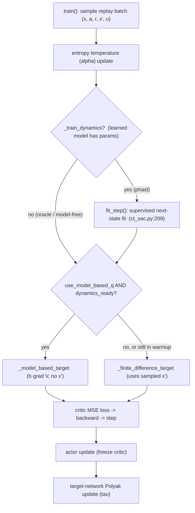
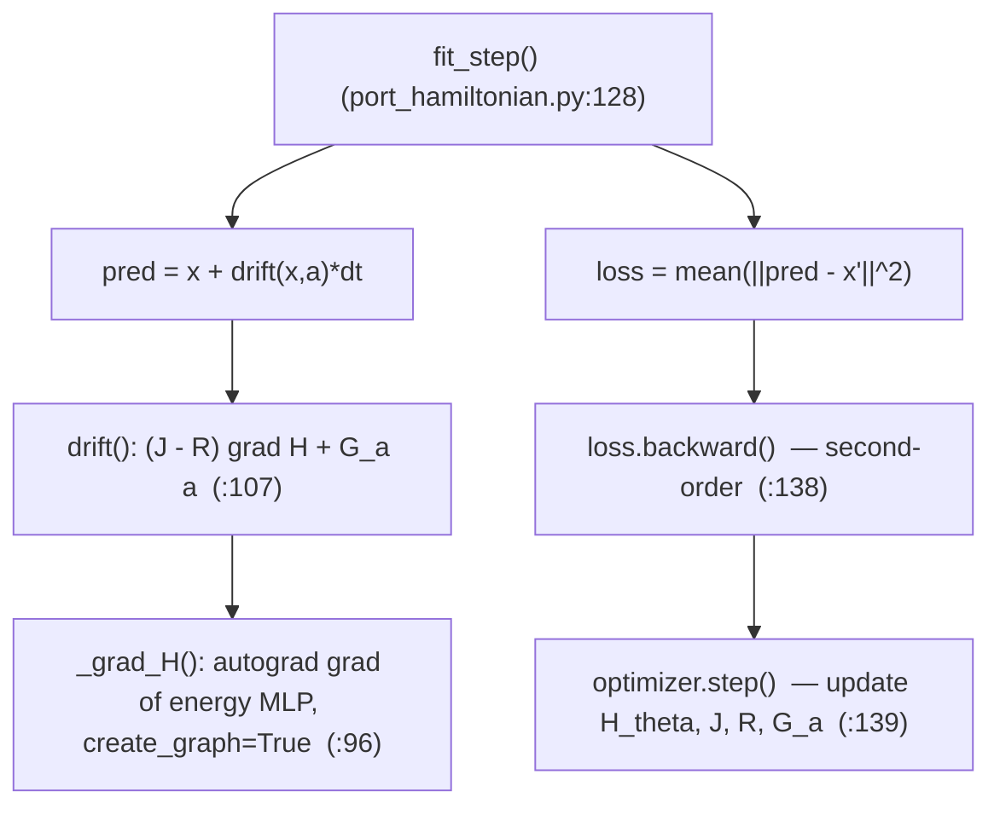

# CT-SAC Model-Based Extension — Implementation and Training Call Stack

:::info
**Summary.** This document describes the model-based extension of CT-SAC: a port-Hamiltonian dynamics model (`PortHamiltonianModel`) supplies the drift `b(x,a)`, which lets the critic target be computed from a *model* of the dynamics — the analytic generator $(\mathcal{L}^a V) = b\cdot\nabla V$ — instead of the model-free finite difference over a sampled successor state. It first explains how the dynamics model is implemented, then walks the modified training call stack, and finally contrasts the model-based and model-free paths. File/line references point to `algorithms/ct_sac.py` and `models/port_hamiltonian.py`.
:::

[TOC]

---

## 1. Context

CT-SAC trains a critic toward the continuous-time advantage-rate target

$$
q_V(x,a) = r(x,a) - \alpha\log\pi(a\mid x) + (\mathcal{L}^a V)(x) - \beta V(x),
\qquad
(\mathcal{L}^a V)(x) = b(x,a)\cdot\nabla V(x) + \tfrac12\mathrm{Tr}\!\big(\sigma\sigma^\top\nabla^2 V\big).
$$

The generator term $(\mathcal{L}^a V)$ depends on the dynamics $(b,\sigma)$. The extension introduces a learned or known model of $b$, controlled by two switches on `CTSAC`:

| Switch | Values | Meaning |
|---|---|---|
| `use_model_based_q` | `False` / `True` | off → model-free finite difference; on → model-based analytic generator |
| `dynamics_source` | `mujoco` / `phast` | exact simulator drift (oracle) vs. a learned port-Hamiltonian |

When `use_model_based_q=False`, none of the model machinery runs and the algorithm is the original CT-SAC.

---

## 2. How the dynamics model (PHAST) is implemented

The model lives in `models/port_hamiltonian.py` as `PortHamiltonianModel(nn.Module)`. It produces a **control-affine, port-Hamiltonian drift**

$$
b(x,a) = \big(J - R\big)\,\nabla H(x) + G_a\,a .
$$

### 2.1 Components

| Symbol | Code | Definition |
|---|---|---|
| Energy `H_θ(x)` | `self.energy` (`__init__`, line 73) | scalar MLP on the observation |
| `∇H(x)` | `_grad_H` (lines 96–103) | autograd gradient of `H_θ` |
| `J` (skew) | `_J` (lines 88–89) | `J = A − Aᵀ` from a free matrix `_J_raw` |
| `R` (PSD) | `_R` (lines 91–94) | `R = softplus(d₀)·I + L Lᵀ` (Householder low-rank) |
| `G_a` (port) | `self.G_a` | linear map `action → state` |

The skew `J` encodes conservative coupling, the PSD `R` encodes dissipation (so the flow is passive, `dH/dt ≤ 0`), and `G_a` injects the action. The drift is assembled in `drift()` (lines 107–117):

```python
gH = self._grad_H(x)        # ∇H(x)
JR = self._J() - self._R()  # (J − R)
return gH @ JR.t() + self.G_a(a)
```

All of `H_θ`, `_J_raw`, `d₀`, `L`, and `G_a` are learnable parameters of a **single, persistent** model instance, trained jointly by the same optimizer. `J` and `R` are **state-independent constant matrices** reconstructed from those parameters on every call (skew-by-construction and PSD-by-construction, respectively), so the drift's *state* dependence enters only through `∇H(x)` and its *action* dependence only through `G_a·a`. The model is **not** refit per timestep — it is updated incrementally by one gradient step per training iteration (see §3).

### 2.2 Two model sources

- **`mujoco` (oracle):** `drift()` calls a supplied `drift_fn` (`environment/dmc.py:dynamics_terms`) that returns the exact observation-space drift from the simulator. No trainable parameters.
- **`phast` (learned):** the structured drift above, with `H_θ, J, R, G_a` trained from data.

### 2.3 Fitting the learned model

`fit_step(obs, action, next_obs, dt, optimizer)` (lines 128–140) is one supervised step: it minimizes the one-step prediction error `‖(x + b·dt) − x'‖²` and updates the model parameters.

:::warning
**Relation to the PHAST paper.** This is a deliberately reduced, UNKNOWN-regime model: a generic energy MLP (not the separable `H = V(q) + ½pᵀM(q)⁻¹p`), a free skew `J` (not the canonical symplectic form), a constant `R` (not state-dependent `D(q)`), no velocity observer / canonicalizer (observations already contain velocities), forward-Euler one-step fitting rather than the paper's Strang splitting, and only the one-step data loss (no passivity / energy / rollout losses). It carries over the port-Hamiltonian *form* and its passivity-by-construction, not the full physical structure.
:::

---

## 3. The modified training call stack

`CTSAC.train()` runs the following once per gradient step. The model-based additions are the **dynamics update** and the **target selection**.



### 3.1 Dynamics update (ct_sac.py:209–214)

Runs only for a trainable model (`_train_dynamics=True`; the oracle has no parameters and is skipped):

```python
if self._train_dynamics:
    dynamics_loss = self.dynamics_model.fit_step(
        obs, actions, next_obs, dt, self.dynamics_optimizer)
    self._dynamics_updates += 1
```

The model has its **own optimizer** (`self.dynamics_optimizer`, built over the model's parameters in `__init__`, line 134) and is trained purely by supervised next-state prediction — **decoupled** from the critic/actor losses.

### 3.2 The `fit_step` sub-chain



Because the loss depends on `∇H` (the drift *is* a gradient of the energy), `loss.backward()` is a **second-order / double backward** — it differentiates through the autograd-computed `∇H` into the MLP weights, which is why `_grad_H` sets `create_graph=True`.

### 3.3 Warmup gate (ct_sac.py:219–220)

```python
dynamics_ready = (not self._train_dynamics) or (self._dynamics_updates >= self.dynamics_warmup)
```

A non-trainable oracle is ready immediately; a learned model is used only after `dynamics_warmup` fits. Until then the critic uses the finite-difference target, so the policy improves model-free-style while the model trains in the background.

### 3.4 Critic target, loss, actor, targets

After the target is selected, the remaining steps are unchanged from CT-SAC: regress all critics to `q_fast_target` (MSE), update the actor against the frozen critic, and Polyak-update the target networks.

---

## 4. Model-based vs. model-free: where the stacks diverge

The two paths are identical up to **target selection**; they differ only in how `q_fast_target` is produced.

| Aspect | Model-free | Model-based generator |
|---|---|---|
| Method | `_finite_difference_target` (ct_sac.py:291) | `_model_based_target` (ct_sac.py:315) |
| Needs sampled `x'`? | **Yes** | No |
| Uses dynamics model? | No | drift `b` + value gradient `∇V` |
| Uses `∇V`? | No | **Yes** |
| Extra cost | lowest | value gradient (+ model fit, if learned) |

**Model-free target** (finite difference over the sampled successor, rescaled time `u = dt/dt_default`):

$$
\text{target} = r + V(x) + \frac{\gamma^{u}\,\mathbb{E}_{a'}[\tilde Q(x',a')] - \mathbb{E}_a[\tilde Q(x,a)]}{u},
\qquad \tilde Q = Q_{\text{target}} - \alpha\log\pi .
$$

**Model-based generator** (first-order analytic generator; no `x'`):

$$
\text{target} = r + V(x) + \Big(\Delta t_{\text{default}}\cdot b(x,a)\cdot\nabla V(x) - \beta\,V(x)\Big).
$$

:::success
**Design rationale and limitation.** The generator removes the dependence on the sampled $x'$ and avoids the finite difference's $1/u$ variance blow-up at small/irregular $u$. Its cost is that it **linearizes** $V$ over an effective step $\lVert b\cdot dt\rVert$: the first-order term is only accurate when $\lVert b\cdot dt\rVert \ll$ the observation scale. For large-drift systems at normal control rates it is biased, so the generator helps specifically in the **small/irregular-$dt$, low-drift** regime; with $dt \approx \Delta t_{\text{default}}$ the model-free finite difference is already the exact soft-Bellman target.
:::

---

## 5. Implementation subtleties

- **Second-order backward.** The dynamics loss depends on `∇H`; training therefore differentiates through a gradient (`create_graph=True` in `_grad_H`). This is the dominant per-step cost of the learned model.
- **`enable_grad` in `_grad_H`.** Wrapping the gradient computation in `th.enable_grad()` lets `∇H` be taken even when the caller is under `th.no_grad()` (the critic target computation).
- **Decoupled losses.** The dynamics model is trained by supervised next-state prediction only; the critic and actor never backpropagate into it.
- **Rescaled-time convention.** The generator term uses `Δt_default·(b·∇V) − β·V` (with physical `b`), which matches the rescaled-time convention of the finite-difference target (`u = dt/dt_default`).

---

## 6. Empirical findings: drift magnitude and the timestep floor

These measurements (cheetah-run, observation $= [\,\text{position}(8),\ \text{velocity}(9)\,]$) determine when the model-based generator is usable.

**The drift is dominated by accelerations.** With $b = d(\text{obs})/dt = [\,\dot q\,;\ \ddot q\,]$, the median norms on random-action data are: velocity block $\lVert\dot q\rVert \approx 7$, acceleration block $\lVert\ddot q\rVert \approx 626$, so $\lVert b\rVert \approx 600$.

**Why $\lVert b\rVert$ is large — not contacts.** No-contact states have the same mean $\lVert\ddot q\rVert$ as contact states, and the correlation of $\lVert\ddot q\rVert$ with contact force is $\approx 0.02$. The cause is $\ddot q = M^{-1}(\tau - c(q,\dot q) - g(q))$ with (i) light limbs $\Rightarrow$ small inertia $\Rightarrow$ large $M^{-1}$, and (ii) large velocities (from vigorous exploration) $\Rightarrow$ large Coriolis/centrifugal $c \propto \dot q^{2}$.

$\lVert b\rVert$ scales with exploration vigor, but the *run* task forces high velocity regardless:

| random-action scale | $\lVert\dot q\rVert$ | $\lVert\ddot q\rVert$ | $\lVert b\rVert$ |
|---|---|---|---|
| 1.0 | 7.0 | 652 | 652 |
| 0.3 | 2.2 | 164 | 164 |
| 0.1 | 0.6 | 47 | 47 |

Gentler actions shrink $\lVert b\rVert$, but cheetah-run rewards forward speed, so the optimal policy operates at high velocity where $\lVert b\rVert$ is large — and the generator is evaluated at the policy's own states.

**The first-order generator is valid only for small $\lVert b\,\Delta t\rVert$.** The term $(b\cdot\nabla V)\,\Delta t$ approximates $V(x') - V(x)$ well only when the effective step is small relative to the observation scale ($\sim O(1)$). Correlation of the first-order estimate with the true value change:

| $\Delta t$ | $\lVert b\,\Delta t\rVert$ | corr(first-order, true $\Delta V$) |
|---|---|---|
| 0.001 (below floor) | $\approx 0.5$ | $\approx 0.82$ |
| 0.002 (physics floor) | $\approx 1.1$ | $\approx 0.82$ |
| 0.01 (benchmark) | $\approx 6$ | $\approx 0.2$ |
| 0.03 (benchmark max) | $\approx 18$ | $\approx 0.2$ |

**The physics floor is the obstacle.** The CT-RL paper's finest timestep for cheetah is $\Delta t_{\text{physics}} = 0.002$ (the MuJoCo model's native step is $0.01$). The generator's clean regime needs $\Delta t \lesssim 0.001$ — *below* the floor. So across the paper's entire legitimate control range $\Delta t \in [0.002, 0.03]$ the first-order step is biased; $\Delta t = 0.002$ is the borderline. Reaching the clean regime would require sub-physics-step control, which is not a valid configuration.

**Second-order does not rescue it.** Adding $\tfrac12 (b\,\Delta t)^\top \nabla^2 V (b\,\Delta t)$ leaves the correlation essentially unchanged ($0.818 \to 0.817$ at the floor) — the residual error is the dynamics step ($b\,\Delta t \neq x' - x$), not the curvature of $V$.

**Conclusion.** For cheetah the generator's valid regime ($\lVert b\,\Delta t\rVert \ll 1$) sits *below* the simulation's physics resolution, so it cannot be applied cleanly at legitimate timescales; the method suits genuinely low-drift / fine-timescale systems (e.g. the trading environment). The one legitimate borderline worth an empirical test is the floor $\Delta t = 0.002$, where the first-order correlation is $\approx 0.82$ when the critic is trained at that timescale.

---

## 7. Target variance at fine timescales: why the model helps at the floor

An earlier version of this section argued the generator simply could not train (non-contraction). A 12-seed run at the floor refuted the strong form of that claim: the oracle generator **beat** model-free (eval $826 \pm 760$ vs $430 \pm 500$). The dominant mechanism is **target variance**, and it is controlled by the rescaled timestep — derived below and confirmed in code.

**Rescaled time — the floor is $u = 0.2$, not $1$.** The targets are expressed in $u = \Delta t \cdot \texttt{time\_rescale} = \Delta t / \Delta t_{\text{default}}$, where $\Delta t_{\text{default}}$ is the env's *native control timestep* (`dmc.py:133`, `control_timestep()`; cheetah $= 0.01$) — **not** the sampling step. So the floor $\Delta t = 0.002$ is $u = 0.2$: the sub-unit regime, which is exactly where the two targets diverge.

**The two targets.** Let $\hat V(x) = \tilde Q(x, a_s)$, $a_s \sim \pi$, be the single-sample value estimate (`num_expectation_samples`$=1$, so $\mathbb{E}[\hat V] = V$, $\operatorname{Var}[\hat V] = \sigma^2$). Regrouping the code's expressions:
$$
T_{\text{MF}} = r + \hat V(x)\Big(1 - \tfrac{1}{u}\Big) + \frac{\gamma^{u}}{u}\,\hat V(x'),
\qquad
T_{\text{MB}} = r + (1-\beta)\,\hat V(x) + \Delta t_{\text{default}}\,\big(b\cdot\nabla \hat V(x)\big).
$$
(The model-free form is the code's $r + \hat V(x) + (\gamma^{u}\hat V(x') - \hat V(x))/u$; the generator form is `_model_based_target`.)

**Model-free divides the value *difference* by $u$.** With $\hat V(x), \hat V(x')$ independent of variance $\sigma^2$:
$$
\operatorname{Var}[T_{\text{MF}}] = \sigma^2\!\left[\Big(1-\tfrac{1}{u}\Big)^2 + \frac{\gamma^{2u}}{u^2}\right]
\;\xrightarrow{\,u\to 0\,}\; \frac{2\sigma^2}{u^2},
\qquad \operatorname{std}[T_{\text{MF}}] \sim \frac{\sqrt{2}\,\sigma}{u}.
$$
The finite difference estimates the per-step value change by subtracting two noisy values and **dividing by the small step $u$**, so its variance blows up as $u \to 0$. It is *minimized* at $u = 1$, where the $\hat V(x)$ term cancels and $\operatorname{std} = \gamma\sigma$.

**The generator does not.** $T_{\text{MB}}$ contains no $1/u$: its variance is $(1-\beta)^2\sigma^2 + \Delta t_{\text{default}}^2\,\lVert b\rVert^2\,\sigma_{\nabla}^2$, **independent of $u$** (and of $\Delta t$). It is bounded by the value- and gradient-noise, not amplified by fine stepping.

**Measured** (cheetah-run, oracle drift, critic trained 4k steps; target std over 200 policy resamples on a fixed batch):

| $u$ | $\Delta t$ | $\operatorname{std}[T_{\text{MF}}]$ | $\operatorname{std}[T_{\text{MB}}]$ |
|---|---|---|---|
| **0.2** | **0.002 (floor)** | **1.72** | **0.86** |
| 0.25 | 0.0025 | 0.97 | $\approx 0.75$ |
| 0.5 | 0.005 | 0.43 | $\approx 0.75$ |
| 1.0 | 0.01 (benchmark) | 0.19 | $\approx 0.75$ |
| 2.0 | 0.02 | 0.14 | $\approx 0.75$ |

The $\sim\!1/u$ blow-up of the model-free target is exactly as derived; the generator target is flat in $u$. The two cross near $u \approx 0.25$: **below it (including the floor) the generator target is the lower-variance one; above it the finite difference wins** — and there the $\lVert b\,\Delta t\rVert$ linearization bias of §6 also turns against the generator. At the floor the generator target is $\approx 2\times$ less noisy, which is the mechanism behind the 12-seed result, and is consistent with the model-free arm *degrading* over training ($789 \to 430$ from 510k→1M) as its high-variance targets destabilize the long-horizon ($\gamma = 0.996$) value.

:::info
**The non-contraction caveat still holds, but it is not the floor story.** $b\cdot\nabla V$ is a differential operator and lacks a sup-norm contraction — the CT-RL paper proves convergence "sidestepping the challenge that generator-based Hamiltonians lack Bellman-style contraction under the sup-norm." This shows up as heavy *seed* variance (both arms span ~2–2000 across 12 seeds), not as the uniform divergence an earlier single-seed run suggested. The dominant effect at the floor is the target-variance advantage above.
:::

:::warning
**This is the oracle.** The low-variance term $\Delta t_{\text{default}}(b\cdot\nabla\hat V)$ is clean only because $b$ is *exact*. A learned drift injects model **error** (bias, not just variance) into that term; whether a learned model keeps the variance advantage without too much bias is precisely what the `mbq_phast_floor` run tests.
:::

**Takeaway.** The generator helps in the **fine-timestep regime** ($u \ll 1$), where the model-free finite difference must divide a noisy value difference by a small step — the CT-RL setting's own motivation (continuous-time methods matter most as $\Delta t \to 0$), now visible directly in the target variance. Above $u \approx 0.25$ the finite difference is both lower-variance and unbiased, so model-free is preferred.

---

## 8. The per-component gated blend (`generator_gate_scale`)

§6 showed the first-order generator fails because the effective step $\lVert b\,\Delta t\rVert$ is large — but that failure is **concentrated**, not uniform. The drift is dominated by a handful of stiff acceleration coordinates ($\ddot q$ at high velocity / contact), while many coordinates (positions, slow joints) have small $\lvert b_i\,\Delta t\rvert$ and remain first-order valid. The gated blend is a per-coordinate trust region that keeps the analytic drift where it is valid and falls back to the data where it is not.

**The gate.** For each observation coordinate $i$, with scale $s = $ `generator_gate_scale`,
$$
g_i \;=\; \exp\!\big(-\,\lvert b_i\,\Delta t\rvert\,/\,s\big)\;\in(0,1],
\qquad
b_i^{\text{blend}} \;=\; g_i\,b_i \;+\; (1-g_i)\,\frac{x'_i - x_i}{\Delta t}.
$$
The blended drift is fed into the *same* generator target $\Delta t_{\text{default}}\,(b^{\text{blend}}\!\cdot\nabla V) - \beta V$. Coordinates with $\lvert b_i\,\Delta t\rvert \ll s$ keep the analytic drift; coordinates with $\lvert b_i\,\Delta t\rvert \gg s$ use the realized drift $(x'_i - x_i)/\Delta t$ read straight from the buffer.

**Two limits.** The scale $s$ interpolates between the two existing targets:

| $s$ | gate | blended drift | reduces to |
|---|---|---|---|
| $\to\infty$ | $g_i \to 1$ | $b^{\text{blend}} = b$ | the pure generator (`mbq` target) |
| $\to 0$ | $g_i \to 0$ | $b^{\text{blend}} = (x'-x)/\Delta t$ | a first-order finite difference ($\approx$ model-free) |
| intermediate | per-coord | analytic on smooth coords, data on stiff | the trust region |

**Why per-component, not a global blend.** The value change $\Delta V$ is a single scalar, and the linearization error is dominated by the *largest* $\lvert b_i\,\Delta t\rvert$ coordinate ($\approx \tfrac12 (b_i\,\Delta t)^2\,\partial^2 V/\partial x_i^2$). One stiff coordinate corrupts the whole target, so a scalar weight cannot separate the good contributions from the bad — the gate must act coordinate-by-coordinate, replacing exactly the offending coordinates' contribution with the realized value.

:::info
This is a bias trade on the *drift used in the rate* — it uses the real next state $x'$ and the real reward, with **no** reward model and **no** predicted-state rollout. It does not free the stiff subspace from needing $x'$; it only lets the analytic generator carry the coordinates where it is trustworthy.
:::

**Where it is expected to help.** Not at the floor: there $u = 0.2$ and the *pure* generator already wins on target variance (§7), so the gate — which routes the large-$\lvert b_i\Delta t\rvert$ coordinates back to the (high-variance, $1/u$) realized drift — would *re-introduce* the noise the generator was avoiding. The blend instead targets the **irregular** regime $\Delta t = 0.01$ ($u = 1$), where the finite difference is low-variance but the pure oracle was *worst* ($\lVert b\,\Delta t\rVert \approx 6$, §6) and a smooth learned PHAST drift previously beat model-free $\approx 3\times$. The gate is designed to retain that smooth-subspace advantage while stopping the stiff coordinates from poisoning the target. Note the gate scale must be set against §6's validity curve (the generator is useful out to $\lVert b_i\,\Delta t\rVert \approx 1\text{–}3$), so `generator_gate_scale` $\approx 3$, not $0.3$.

**What it does not fix.** The blend reduces *target bias*; it does not change the value-iteration's lack of contraction (§7). It is complementary to the stability levers (small flow step, explicit $V$-head, ensembles), not a substitute.

**Modes.** `algo_generator_gate_scale` (default $0$ = off, leaving all existing runs unchanged). Two cheetah-run test modes at irregular $\Delta t = 0.01$, $s = 0.3$: `mbq_gate` (oracle drift) and `mbq_gate_phast` (learned PHAST drift), to be compared against `mbq`, `mbq_phast`, and a model-free irregular baseline.

---

## Appendix — file/line reference

| Item | Location |
|---|---|
| Dynamics optimizer construction | `algorithms/ct_sac.py:134` |
| Dynamics update (`fit_step` call) | `algorithms/ct_sac.py:209–214` |
| Warmup gate | `algorithms/ct_sac.py:219–220` |
| Target selection (generator / finite-difference) | `algorithms/ct_sac.py:223–232` |
| `_finite_difference_target` | `algorithms/ct_sac.py:291` |
| `_model_based_target` | `algorithms/ct_sac.py:315` |
| Per-component gated blend (§8) | `algorithms/ct_sac.py` `_model_based_target`, `generator_gate_scale` |
| Gated-blend modes (`mbq_gate`, `mbq_gate_phast`) | `benchmarks/hyperparams/ct_sac.csv` |
| Energy MLP `H_θ` | `models/port_hamiltonian.py:73` |
| `_grad_H` (autograd `∇H`) | `models/port_hamiltonian.py:96–103` |
| `drift` (`(J−R)∇H + G_a a`) | `models/port_hamiltonian.py:107–117` |
| `fit_step` (loss / backward / step) | `models/port_hamiltonian.py:128–140` |
