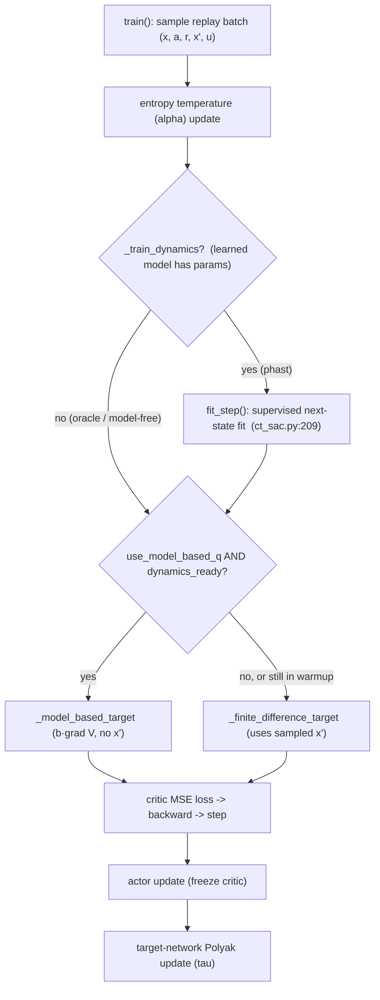
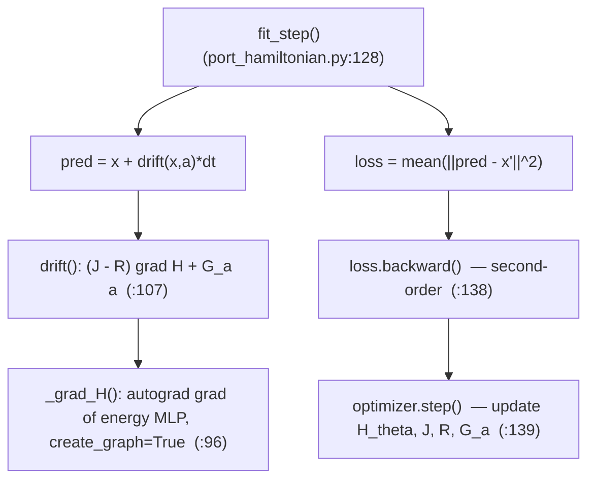

# CT-SAC Model-Based Extension — Implementation and Training Call Stack

:::info
**Summary.** This document describes the model-based extension of CT-SAC: a port-Hamiltonian dynamics model (`PortHamiltonianModel`) supplies the drift `b(x,a)`, which lets the critic target be computed from a *model* of the dynamics — the analytic generator $(\mathcal{L}^a V) = b\cdot\nabla V$. (The model-free baseline computes the same target from a finite difference over a sampled successor state.) The document first explains how the dynamics model is implemented, then walks the modified training call stack, and finally compares the two paths. File/line references point to `algorithms/ct_sac.py` and `models/port_hamiltonian.py`.
:::

[TOC]

---

## 1. Context

CT-SAC trains a critic toward the continuous-time advantage-rate target

$$
q_V(x,a) = r(x,a) - \alpha\log\pi(a\mid x) + (\mathcal{L}^a V)(x) - \beta V(x),
\qquad
(\mathcal{L}^a V)(x) = b(x,a)\cdot\nabla V(x) + \tfrac12\mathrm{Tr}\!\big(\sigma\sigma^\top\nabla^2 V\big).
$$

The generator term $(\mathcal{L}^a V)$ depends on the dynamics $(b,\sigma)$. The extension introduces a learned or known model of $b$, controlled by two switches on `CTSAC`:

| Switch | Values | Meaning |
|---|---|---|
| `use_model_based_q` | `False` / `True` | off → model-free finite difference; on → model-based analytic generator |
| `dynamics_source` | `mujoco` / `phast` | exact simulator drift (oracle) vs. a learned port-Hamiltonian |

When `use_model_based_q=False`, none of the model machinery runs and the algorithm is the original CT-SAC.

---

## 2. How the dynamics model (PHAST) is implemented

The model lives in `models/port_hamiltonian.py` as `PortHamiltonianModel(nn.Module)`. It produces a **control-affine, port-Hamiltonian drift**

$$
b(x,a) = \big(J - R\big)\,\nabla H(x) + G_a\,a .
$$

### 2.1 Components

| Symbol | Code | Definition |
|---|---|---|
| Energy `H_θ(x)` | `self.energy` (`__init__`, line 73) | scalar MLP on the observation |
| `∇H(x)` | `_grad_H` (lines 96–103) | autograd gradient of `H_θ` |
| `J` (skew) | `_J` (lines 88–89) | `J = A − Aᵀ` from a free matrix `_J_raw` |
| `R` (PSD) | `_R` (lines 91–94) | `R = softplus(d₀)·I + L Lᵀ` (Householder low-rank) |
| `G_a` (port) | `self.G_a` | linear map `action → state` |

The skew `J` encodes conservative coupling, the PSD `R` encodes dissipation (so the flow is passive, `dH/dt ≤ 0`), and `G_a` injects the action. The drift is assembled in `drift()` (lines 107–117):

```python
gH = self._grad_H(x)        # ∇H(x)
JR = self._J() - self._R()  # (J − R)
return gH @ JR.t() + self.G_a(a)
```

All of `H_θ`, `_J_raw`, `d₀`, `L`, and `G_a` are learnable parameters of a **single, persistent** model instance, trained jointly by the same optimizer. `J` and `R` are **state-independent constant matrices** reconstructed from those parameters on every call (skew-by-construction and PSD-by-construction, respectively), so the drift's *state* dependence enters only through `∇H(x)` and its *action* dependence only through `G_a·a`. The model is **not** refit per timestep — it is updated incrementally by one gradient step per training iteration (see §3).

### 2.2 Two model sources

- **`mujoco` (oracle):** `drift()` calls a supplied `drift_fn` (`environment/dmc.py:dynamics_terms`) that returns the exact observation-space drift from the simulator. No trainable parameters.
- **`phast` (learned):** the structured drift above, with `H_θ, J, R, G_a` trained from data.

### 2.3 Fitting the learned model

`fit_step(obs, action, next_obs, dt, optimizer)` (lines 128–140) is one supervised step: it minimizes the one-step prediction error `‖(x + b·dt) − x'‖²` and updates the model parameters.

:::warning
**Relation to the PHAST paper.** This is a deliberately reduced, UNKNOWN-regime model. It uses a generic energy MLP, a free skew `J`, a constant `R`, forward-Euler one-step fitting, and the one-step data loss alone; the observations already contain velocities, so the velocity observer / canonicalizer is omitted. The paper's fuller model adds the separable form `H = V(q) + ½pᵀM(q)⁻¹p`, the canonical symplectic `J`, a state-dependent `D(q)`, Strang splitting, and passivity / energy / rollout losses. The reduced model retains the port-Hamiltonian *form* and its passivity-by-construction; the remaining physical structure is left for later milestones.
:::

---

## 3. The modified training call stack

`CTSAC.train()` runs the following once per gradient step. The model-based additions are the **dynamics update** and the **target selection**.



### 3.1 Dynamics update (ct_sac.py:209–214)

Runs only for a trainable model (`_train_dynamics=True`; the oracle has no parameters and is skipped):

```python
if self._train_dynamics:
    dynamics_loss = self.dynamics_model.fit_step(
        obs, actions, next_obs, dt, self.dynamics_optimizer)
    self._dynamics_updates += 1
```

The model has its **own optimizer** (`self.dynamics_optimizer`, built over the model's parameters in `__init__`, line 134) and is trained purely by supervised next-state prediction — **decoupled** from the critic/actor losses.

### 3.2 The `fit_step` sub-chain



Because the loss depends on `∇H` (the drift *is* a gradient of the energy), `loss.backward()` is a **second-order / double backward** — it differentiates through the autograd-computed `∇H` into the MLP weights, which is why `_grad_H` sets `create_graph=True`.

### 3.3 Warmup gate (ct_sac.py:219–220)

```python
dynamics_ready = (not self._train_dynamics) or (self._dynamics_updates >= self.dynamics_warmup)
```

A non-trainable oracle is ready immediately; a learned model is used only after `dynamics_warmup` fits. Until then the critic uses the finite-difference target, so the policy improves model-free-style while the model trains in the background.

### 3.4 Critic target, loss, actor, targets

After the target is selected, the remaining steps are unchanged from CT-SAC: regress all critics to `q_fast_target` (MSE), update the actor against the frozen critic, and Polyak-update the target networks.

---

## 4. Model-based vs. model-free: where the stacks diverge

The two paths are identical up to **target selection**; they differ only in how `q_fast_target` is produced.

| Aspect | Model-free | Model-based generator |
|---|---|---|
| Method | `_finite_difference_target` (ct_sac.py:291) | `_model_based_target` (ct_sac.py:315) |
| Needs sampled `x'`? | **Yes** | No |
| Uses dynamics model? | No | drift `b` + value gradient `∇V` |
| Uses `∇V`? | No | **Yes** |
| Extra cost | lowest | value gradient (+ model fit, if learned) |

**Model-free target** (finite difference over the sampled successor, rescaled time `u = dt/dt_default`):

$$
\text{target} = r + V(x) + \frac{\gamma^{u}\,\mathbb{E}_{a'}[\tilde Q(x',a')] - \mathbb{E}_a[\tilde Q(x,a)]}{u},
\qquad \tilde Q = Q_{\text{target}} - \alpha\log\pi .
$$

**Model-based generator** (first-order analytic generator; no `x'`):

$$
\text{target} = r + V(x) + \Big(\Delta t_{\text{default}}\cdot b(x,a)\cdot\nabla V(x) - \beta\,V(x)\Big).
$$

:::success
**Design rationale and limitation.** The generator removes the dependence on the sampled $x'$ and avoids the finite difference's $1/u$ variance blow-up at small/irregular $u$. Its cost is that it **linearizes** $V$ over an effective step $\lVert b\cdot dt\rVert$: the first-order term is only accurate when $\lVert b\cdot dt\rVert \ll$ the observation scale. For large-drift systems at normal control rates it is biased, so the generator helps specifically in the **small/irregular-$dt$, low-drift** regime; with $dt \approx \Delta t_{\text{default}}$ the model-free finite difference is already the exact soft-Bellman target.
:::

---

## 5. Implementation subtleties

- **Second-order backward.** The dynamics loss depends on `∇H`; training therefore differentiates through a gradient (`create_graph=True` in `_grad_H`). This is the dominant per-step cost of the learned model.
- **`enable_grad` in `_grad_H`.** Wrapping the gradient computation in `th.enable_grad()` lets `∇H` be taken even when the caller is under `th.no_grad()` (the critic target computation).
- **Decoupled losses.** The dynamics model is trained by supervised next-state prediction only; the critic and actor never backpropagate into it.
- **Rescaled-time convention.** The generator term uses `Δt_default·(b·∇V) − β·V` (with physical `b`), which matches the rescaled-time convention of the finite-difference target (`u = dt/dt_default`).

---

## 6. Empirical findings: drift magnitude and the timestep floor

These measurements (cheetah-run, observation $= [\,\text{position}(8),\ \text{velocity}(9)\,]$) determine when the model-based generator is usable.

**The drift is dominated by accelerations.** With $b = d(\text{obs})/dt = [\,\dot q\,;\ \ddot q\,]$, the median norms on random-action data are: velocity block $\lVert\dot q\rVert \approx 7$, acceleration block $\lVert\ddot q\rVert \approx 626$, so $\lVert b\rVert \approx 600$.

**The source of the large $\lVert b\rVert$.** Contacts are not the driver: no-contact states have the same mean $\lVert\ddot q\rVert$ as contact states, and the correlation of $\lVert\ddot q\rVert$ with contact force is $\approx 0.02$. The cause is $\ddot q = M^{-1}(\tau - c(q,\dot q) - g(q))$ with (i) light limbs $\Rightarrow$ small inertia $\Rightarrow$ large $M^{-1}$, and (ii) large velocities (from vigorous exploration) $\Rightarrow$ large Coriolis/centrifugal $c \propto \dot q^{2}$.

$\lVert b\rVert$ scales with exploration vigor, but the *run* task forces high velocity regardless:

| random-action scale | $\lVert\dot q\rVert$ | $\lVert\ddot q\rVert$ | $\lVert b\rVert$ |
|---|---|---|---|
| 1.0 | 7.0 | 652 | 652 |
| 0.3 | 2.2 | 164 | 164 |
| 0.1 | 0.6 | 47 | 47 |

Gentler actions shrink $\lVert b\rVert$, but cheetah-run rewards forward speed, so the optimal policy operates at high velocity where $\lVert b\rVert$ is large — and the generator is evaluated at the policy's own states.

**The first-order generator is valid only for small $\lVert b\,\Delta t\rVert$.** The term $(b\cdot\nabla V)\,\Delta t$ approximates $V(x') - V(x)$ well only when the effective step is small relative to the observation scale ($\sim O(1)$). Correlation of the first-order estimate with the true value change:

| $\Delta t$ | $\lVert b\,\Delta t\rVert$ | corr(first-order, true $\Delta V$) |
|---|---|---|
| 0.001 (below floor) | $\approx 0.5$ | $\approx 0.82$ |
| 0.002 (physics floor) | $\approx 1.1$ | $\approx 0.82$ |
| 0.01 (benchmark) | $\approx 6$ | $\approx 0.2$ |
| 0.03 (benchmark max) | $\approx 18$ | $\approx 0.2$ |

**The physics floor is the obstacle.** The CT-RL paper's finest timestep for cheetah is $\Delta t_{\text{physics}} = 0.002$ (the MuJoCo model's native step is $0.01$). The generator's clean regime needs $\Delta t \lesssim 0.001$ — *below* the floor. So across the paper's entire legitimate control range $\Delta t \in [0.002, 0.03]$ the first-order step is biased; $\Delta t = 0.002$ is the borderline. Reaching the clean regime would require sub-physics-step control, which is not a valid configuration.

**Second-order, and why it does not rescue the floor.** Adding $\tfrac12 (b\,\Delta t)^\top \nabla^2 V (b\,\Delta t)$ leaves the correlation essentially unchanged at the floor ($\approx 0.82 \to 0.82$). A decomposition (quadratic $V$, where the Taylor expansion is *exact*, against the real MLP critic) shows two distinct residuals, each dominating in a different regime. The two estimates compared against the true $\Delta V = V(x') - V(x)$ are
$$
g_1 = \nabla V(x)\cdot(b\,\Delta t),
\qquad
g_2 = \nabla V(x)\cdot(b\,\Delta t) + \tfrac12 (b\,\Delta t)^\top \nabla^2 V\,(b\,\Delta t),
$$
so the "1st-order" column is itself the readout of **$\nabla V$ quality** (how well the value gradient, dotted into the step, predicts $\Delta V$); there is no separate $\nabla V$ column because $g_1$ *is* that measurement.

| value function | $\Delta t$ | $\lVert\Delta x - b\,\Delta t\rVert / \lVert\Delta x\rVert$ | corr$(g_1,\Delta V)$ | corr$(g_2,\Delta V)$ |
|---|---|---|---|---|
| exact quadratic | 0.002 | 0.05 | 0.996 | **1.000** |
| exact quadratic | 0.01 | 0.24 | 0.915 | **0.976** |
| real MLP critic | 0.002 | 0.05 | 0.24$^\dagger$ | **0.24** |

$^\dagger$ a lightly-trained critic; the *level* tracks critic quality, but the **flat** response to the Hessian is the robust point. **Read rows 1 vs 3:** same $\Delta t$, same displacement mismatch (0.05) — only the value function differs, yet corr$(g_1)$ collapses $0.996 \to 0.24$. That collapse is purely $\nabla V$ quality (exact gradient vs. rough MLP gradient plus single-sample $\mathbb{E}_a$ noise).

- **With an exact $V$ the Taylor term behaves as theory predicts:** 0.996 $\to$ 1.000 at the floor. The second-order math is sound; the limit comes from the *value function*.
- **At the floor, the bottleneck is critic $\nabla V$ quality.** With the real MLP critic the first-order term is already only weakly correlated with $\Delta V$ (the gradient of a trained value MLP is rough, and the single-sample $\mathbb{E}_a$ adds noise), and the Hessian correction is both *tiny* (measured $\approx 5\%$ of the first-order term's magnitude) and computed from an even noisier object (the MLP's second derivative). A small, noisy second-order patch cannot lift a first-order term that is itself the limiter; the fix is a cleaner $\nabla V$ (the explicit scalar $V$-head, §9).
- **At larger $\Delta t$, the displacement mismatch becomes a ceiling.** It grows with $\Delta t$ (5% at the floor $\to$ 24% at $\Delta t = 0.01$) and enters at *first order* in $\nabla V$ (as $\nabla V\cdot(\Delta x - b\,\Delta t)$), so a $V$-side term — gradient or Hessian — leaves it in place (the exact-$V$ Hessian caps at 0.976, short of 1.0, at $\Delta t = 0.01$). Closing it requires better integration of the *dynamics* (RK / implicit, i.e. predicting $x'$).

**Conclusion.** For cheetah the generator's valid regime ($\lVert b\,\Delta t\rVert \ll 1$) sits *below* the simulation's physics resolution, so it cannot be applied cleanly at legitimate timescales; the method suits genuinely low-drift / fine-timescale systems (e.g. the trading environment). The floor $\Delta t = 0.002$ (first-order corr $\approx 0.82$) was the borderline worth testing, and it was tested at 12 seeds (§7): the generator improves per-update target variance, while model-free is equal on final policy and ahead at peak, since the value-iteration's contraction property governs the outcome.

---

## 7. Target variance and training outcome at the floor

This section states the final 12-seed result first, then the two mechanisms behind it: a per-update target-variance effect (§7.1) and a value-iteration contraction effect (§7.2).

**Final result (cheetah-run, floor $\Delta t = 0.002$, 12 seeds, 1M steps).** The oracle generator (`mbq_floor`) matches model-free (`mf_floor`) on final policy and trails it at peak:

| Metric | `mbq_floor` (oracle generator) | `mf_floor` (model-free) | diff | paired $p$ | Welch $p$ | Wilcoxon $p$ |
|---|---|---|---|---|---|---|
| Final policy | $560 \pm 642$, md 280 | $416 \pm 531$, md 200 | $+145$ | 0.61 | 0.55 | 0.85 |
| Peak / best-model | $1586 \pm 693$, md 1779 | $1965 \pm 375$, md 2091 | $-379$ | 0.096 | 0.11 | 0.077 |

The final-policy gap is within noise ($p \approx 0.6$; both medians are low, so *both* arms are collapse-prone by 1M). The near-significant signal is the **peak**, favoring **model-free** ($-379$, $p \approx 0.08\text{–}0.11$), which also reaches its peak more reliably (sd $\pm375$ vs $\pm693$). An earlier mid-training snapshot ($826$ vs $430$ at ~752k) reversed by 1M as `mbq_floor` degraded $826 \to 560$ (collapse-prone seeds fell off). The floor is therefore a wash on final policy, with model-free ahead at peak.

**The two axes.** Per-update target variance and end-to-end outcome variance are separate quantities. §7.1 derives and measures the first, where the generator has the advantage. §7.2 covers the second, which model-free wins and which governs the result.

### 7.1 Target variance favors the generator

**Where this sits relative to the paper.** The paper analyzes two distinct small-$u$ effects, and the derivation below is a concrete instance of the second.

1. *Diffusion-noise* (§3.1 / Eq. 15, after Jia & Zhou 2023): the value increment splits into an $O(u)$ drift and an $O(\sqrt u)$ Brownian martingale $\nabla V\cdot\sigma\,dW$, so for small $u$ naïve TD is dominated by diffusion variation in place of the Bellman drift. This requires a stochastic environment ($\sigma \neq 0$).

2. *Estimation/sampling* (App. G + the finite-sample appendix): the division by $u$ makes the map $V \mapsto q_u^V$ Lipschitz with constant $O(1/u)$. Lemma G.4 gives $\mathbb{E}\lVert q_U^V - q_U^W\rVert_\infty \le 2\,\mathbb{E}[1/U]\,\lVert V-W\rVert_\infty$, so the $q$-convergence rate (Thm G.5) carries a factor $\mathbb{E}[1/U]$ and requires $\mathbb{E}[1/U] < \infty$ — equivalently a minimum step, since $U \ge u_{\min}$ gives $\mathbb{E}[1/U] \le 1/u_{\min}$. The finite-sample bound (Cor. 4.4) correspondingly needs more samples as $u$ shrinks, through an update modulus $1 + \tau/u$.

   The minimum step is an environment setting: the irregular-time sampler draws $U \in [\Delta t_{\min}, \Delta t_{\max}]$, and the floor $\Delta t_{\min}$ is enforced at or above the simulator's physics timestep $\Delta t_{\text{physics}}$ (a finer control step is sub-physics-step, §6). The paper fixes $\Delta t_{\min}$ per task in Table 1 — for cheetah $\Delta t_{\min} = \Delta t_{\text{physics}} = 0.002$, giving $u_{\min} = \Delta t_{\min}/\Delta t_{\text{default}} = 0.2$. The floor runs pin $U$ at this value ($\Delta t_{\min} = \Delta t_{\max} = 0.002$), the largest $\mathbb{E}[1/U]$ the physics allows and so the worst case for this variance term.

The derivation below is the explicit per-update *variance* form of effect (2): $\operatorname{std}[T_{\text{MF}}] \sim \sigma_\pi / u$ is Lemma G.4's $O(1/u)$-Lipschitz bound with the single-sample action-expectation noise $\sigma_\pi$ as the value perturbation. The floor runs use deterministic MuJoCo ($\sigma = 0$), so effect (1) is absent and effect (2) — the action-sampling variance — is the one in play.

**Rescaled time — the floor is $u = 0.2$.** Two timesteps appear in the code. $\Delta t_{\text{default}}$ is cheetah's *nominal* control period, fixed at $0.01$, read once at env construction (`dmc.py:133`, `control_timestep()`); it sets $\texttt{time_rescale} = 1/\Delta t_{\text{default}} = 100$. $\Delta t$ is the *actual* duration of each transition, stored in the buffer — $0.002$ at the floor. The targets are written in rescaled time $u = \Delta t \cdot \texttt{time_rescale} = \Delta t / \Delta t_{\text{default}}$, the transition's duration measured in nominal control periods. The floor normalizes the actual step $0.002$ by the fixed nominal step $0.01$, giving $u = 0.2$. Because the normalizer is the nominal step $0.01$, the floor sits below unit rescaled time even though it is the smallest sampling step the env takes. This sub-unit $u$ is where the two targets diverge.

**The two targets.** Let $\hat V(x) = \tilde Q(x, a_s)$, $a_s \sim \pi$, be the single-sample value estimate (`num_expectation_samples`$=1$, so $\mathbb{E}[\hat V] = V$, $\operatorname{Var}[\hat V] = \sigma_\pi^2$, where $\sigma_\pi$ is the action-sampling noise — distinct from the SDE diffusion $\sigma$ of §1). Regrouping the code's expressions:
$$
T_{\text{MF}} = r + \hat V(x)\Big(1 - \tfrac{1}{u}\Big) + \frac{\gamma^{u}}{u}\,\hat V(x'),
\qquad
T_{\text{MB}} = r + (1-\beta)\,\hat V(x) + \Delta t_{\text{default}}\,\big(b\cdot\nabla \hat V(x)\big).
$$
(The model-free form is the code's $r + \hat V(x) + (\gamma^{u}\hat V(x') - \hat V(x))/u$; the generator form is `_model_based_target`.)

**Model-free divides the value *difference* by $u$.** With $\hat V(x), \hat V(x')$ independent of variance $\sigma_\pi^2$:
$$
\operatorname{Var}[T_{\text{MF}}] = \sigma_\pi^2\!\left[\Big(1-\tfrac{1}{u}\Big)^2 + \frac{\gamma^{2u}}{u^2}\right]
\;\xrightarrow{\,u\to 0\,}\; \frac{2\sigma_\pi^2}{u^2},
\qquad \operatorname{std}[T_{\text{MF}}] \sim \frac{\sqrt{2}\,\sigma_\pi}{u}.
$$
The finite difference estimates the per-step value change by subtracting two noisy values and **dividing by the small step $u$**, so its variance blows up as $u \to 0$. It is *minimized* at $u = 1$, where the $\hat V(x)$ term cancels and $\operatorname{std} = \gamma\sigma_\pi$.

**The generator target.** $T_{\text{MB}}$ contains no $1/u$: its variance is $(1-\beta)^2\sigma_\pi^2 + \Delta t_{\text{default}}^2\,\lVert b\rVert^2\,\sigma_{\nabla}^2$, **independent of $u$** (and of $\Delta t$). It is bounded by the value- and gradient-noise and stays bounded as the step shrinks.

**Measured** (cheetah-run, oracle drift, critic trained 4k steps; target std over 200 policy resamples on a fixed batch):

| $u$ | $\Delta t$ | $\operatorname{std}[T_{\text{MF}}]$ | $\operatorname{std}[T_{\text{MB}}]$ |
|---|---|---|---|
| **0.2** | **0.002 (floor)** | **1.72** | **0.86** |
| 0.25 | 0.0025 | 0.97 | $\approx 0.75$ |
| 0.5 | 0.005 | 0.43 | $\approx 0.75$ |
| 1.0 | 0.01 (benchmark) | 0.19 | $\approx 0.75$ |
| 2.0 | 0.02 | 0.14 | $\approx 0.75$ |

The $\sim\!1/u$ blow-up of the model-free target is exactly as derived; the generator target is flat in $u$. The two cross near $u \approx 0.25$: at or below the floor the generator target is the lower-variance one, and above it the finite difference is lower-variance while the $\lVert b\,\Delta t\rVert$ linearization bias of §6 also grows against the generator. So at the floor the per-update generator target is $\approx 2\times$ less noisy — a real, code-confirmed property. §7.2 covers why this advantage does not decide the run.

### 7.2 The training outcome favors model-free

Lower per-update target variance left the policy no better (§7 table). At the *outcome* level the model-based arm is the *higher-variance* one — sd $\pm642/\pm693$ vs $\pm531/\pm375$ — with lower, less reliable peaks. The cause is a property of the generator backup: it lacks a sup-norm contraction.

$b\cdot\nabla V$ is a **differential** operator: $V_1, V_2$ can be sup-norm-close yet have arbitrarily different gradients, so $b\cdot\nabla(V_1-V_2)$ can *amplify* a small value error. The model-free soft-Bellman backup **averages** $V$ over $x'$ and scales by $\gamma<1$ — a $\gamma$-contraction with a Banach fixed point that damps such errors. The CT-RL paper relies on this distinction: it proves convergence "via new probabilistic arguments, sidestepping the challenge that **generator-based Hamiltonians lack Bellman-style contraction under the sup-norm**."

Empirically this appears as a heavy **collapse tail** (an earlier single-seed run had suggested uniform divergence): across 12 seeds both arms span ~2–2000, and the generator's missing contraction gives it the larger spread and the lower peaks. The two effects act on different axes, and the contraction axis sets the outcome:

| Axis | Favors | Why |
|---|---|---|
| Per-update target variance ($u=0.2$) | **generator** ($\approx 2\times$) | no $1/u$ differencing (§7.1) |
| End-to-end outcome (peak, seed spread) | **model-free** | $\gamma$-contraction damps error; generator amplifies it |

:::warning
**This result uses the oracle — the favorable case.** The low-variance term $\Delta t_{\text{default}}(b\cdot\nabla\hat V)$ is clean because $b$ is *exact*. The exact-drift generator already fails to beat model-free at the floor, and a *learned* drift would add bias on top, so the `mbq_phast_floor` test was dropped as moot.
:::

**Takeaway.** The generator has a low-variance advantage in the fine-timestep regime ($u \ll 1$), where the model-free finite difference divides a noisy value difference by a small step — the CT-RL setting's own motivation. At the floor the value-iteration's lack of contraction outweighs that advantage: 12 seeds show no significant final-policy difference and a model-free edge at peak. The model-based generator matches model-free on final policy at the floor and trails it at peak. The remaining best-posed test is the *irregular*-dt gated blend (§8).

---

## 8. The per-component gated blend (`generator_gate_scale`)

§6 showed the first-order generator fails because the effective step $\lVert b\,\Delta t\rVert$ is large, and that failure is **concentrated in a few coordinates**. The drift is dominated by a handful of stiff acceleration coordinates ($\ddot q$ at high velocity / contact), while many coordinates (positions, slow joints) have small $\lvert b_i\,\Delta t\rvert$ and remain first-order valid. The gated blend is a per-coordinate trust region: it keeps the analytic drift on the small-$\lvert b_i\,\Delta t\rvert$ coordinates and uses the data on the large ones.

**The gate.** For each observation coordinate $i$, with scale $s = $ `generator_gate_scale`,
$$
g_i \;=\; \exp\!\big(-\,\lvert b_i\,\Delta t\rvert\,/\,s\big)\;\in(0,1],
\qquad
b_i^{\text{blend}} \;=\; g_i\,b_i \;+\; (1-g_i)\,\frac{x'_i - x_i}{\Delta t}.
$$
The blended drift is fed into the *same* generator target $\Delta t_{\text{default}}\,(b^{\text{blend}}\!\cdot\nabla V) - \beta V$. Coordinates with $\lvert b_i\,\Delta t\rvert \ll s$ keep the analytic drift; coordinates with $\lvert b_i\,\Delta t\rvert \gg s$ use the realized drift $(x'_i - x_i)/\Delta t$ read straight from the buffer.

**Two limits.** The scale $s$ interpolates between the two existing targets:

| $s$ | gate | blended drift | reduces to |
|---|---|---|---|
| $\to\infty$ | $g_i \to 1$ | $b^{\text{blend}} = b$ | the pure generator (`mbq` target) |
| $\to 0$ | $g_i \to 0$ | $b^{\text{blend}} = (x'-x)/\Delta t$ | a first-order finite difference ($\approx$ model-free) |
| intermediate | per-coord | analytic on smooth coords, data on stiff | the trust region |

**Why the gate acts per-component.** The value change $\Delta V$ is a single scalar, and the linearization error is dominated by the *largest* $\lvert b_i\,\Delta t\rvert$ coordinate ($\approx \tfrac12 (b_i\,\Delta t)^2\,\partial^2 V/\partial x_i^2$). One stiff coordinate corrupts the whole target. A scalar weight cannot separate the good contributions from the bad, so the gate acts coordinate-by-coordinate, replacing the offending coordinates' contribution with the realized value.

:::info
This is a bias trade on the *drift used in the rate*: it uses the real next state $x'$ and the real reward, with **no** reward model and **no** predicted-state rollout. The stiff subspace still requires $x'$; the analytic generator carries only the coordinates where it is trustworthy.
:::

**Where it is expected to help.** The target is the **irregular** regime $\Delta t = 0.01$ ($u = 1$), where the finite difference is low-variance, the pure oracle is worst ($\lVert b\,\Delta t\rVert \approx 6$, §6), and a smooth learned PHAST drift previously beat model-free $\approx 3\times$. The gate retains that smooth-subspace advantage while keeping the stiff coordinates from poisoning the target. At the floor the gate is counterproductive: there $u = 0.2$, the pure generator already wins on target variance (§7), and routing the large-$\lvert b_i\Delta t\rvert$ coordinates back to the (high-variance, $1/u$) realized drift would re-introduce the noise the generator avoids. The scale follows §6's validity curve (the generator is useful out to $\lVert b_i\,\Delta t\rVert \approx 1\text{–}3$), giving `generator_gate_scale` $\approx 3$.

**Scope.** The blend reduces *target bias*. The value-iteration's lack of contraction (§7) is unchanged, so the blend works alongside the stability levers (small flow step, explicit $V$-head, ensembles).

**Modes.** `algo_generator_gate_scale` (default $0$ = off, leaving all existing runs unchanged). Two cheetah-run test modes at irregular $\Delta t = 0.01$, $s = 3$: `mbq_gate` (oracle drift) and `mbq_gate_phast` (learned PHAST drift), to be compared against `mbq`, `mbq_phast`, and a model-free irregular baseline. The scale $s \approx 3$ is set from §6's validity curve (the generator is useful out to $\lVert b_i\,\Delta t\rVert \approx 1\text{–}3$); $s = 0.3$ would gate away the very coordinates the generator helps on.

---

## 9. The explicit scalar value head (`v_net_arch`)

§6 traced the floor-regime failure of the generator to **$\nabla V$ quality**: with the value read as $V(x) = \mathbb{E}_{a\sim\pi}[\,\min_i Q_i(x,a) - \alpha\log\pi\,]$, the gradient $\nabla_x V$ is differentiated through the twin-minimum *and* the stochastic policy, so it is rough and single-sample-noisy, and that roughness caps the first-order generator (§6). The fix is to read $V$ and $\nabla V$ from a dedicated **state-only scalar head** $V_\psi(x)$, the $Q = V + q$ decoupling.

**What it is.** `ActorQCriticModel` gains an optional value head (`v_net_arch`, default `None` = off → exact legacy behavior) plus a lagged target copy $V_{\bar\psi}$. The twin-$Q$ critic and the actor are unchanged; the head is added alongside them.

**How it is trained.** Each step, $V_\psi(x)$ is regressed to the soft value:
$$
\mathcal{L}_V = \big\lVert V_\psi(x) - \mathbb{E}_{a\sim\pi}[\,\min_i Q_i(x,a) - \alpha\log\pi\,]\big\rVert^2 .
$$
The label still samples actions, but that noise is **averaged over training** into a smooth $V_\psi$. The head is a distillation of the soft value into a state-only network.

**How the generator uses it.** The model-based target reads $V$ and $\nabla V$ from the lagged head $V_{\bar\psi}$: the gradient flows to the input $x$ (the target params are frozen), giving a clean, single-MLP value gradient for $b\cdot\nabla V$. Both critic targets route $V$ through a `_state_value` helper, so the head also de-noises the finite-difference target when on.

**Warmup.** `value_warmup` delays the switch: the head trains from the first update, and the targets read it once it has had `value_warmup` regression updates; before that they use the sampled soft value (the legacy `mbq_floor` behavior). This keeps the generator from bootstrapping on an untrained head. `value_warmup = 0` reads the head immediately; the V-head modes set $5000$.

**Sample-free at the point of use.** With the head, the model-based target is **deterministic** — verified at $\approx 0$ variance across RNG seeds, versus $\approx 0.64$ for the sampled $\mathbb{E}_a[\tilde Q]$ path. This is the resolution of the "bypass sampling" question: the generator removes *successor-state* ($x'$) sampling; the head additionally removes the *action-expectation* sampling that defines $V$, so $V$ and $\nabla V$ are both sample-free.

**Scope.** The head targets the $\nabla V$-quality bottleneck (§6 floor regime) and the action-sampling variance (§7.1). Two effects remain outside it: the displacement mismatch at large $\Delta t$ (§6, a first-order error that $V$-side terms leave in place) and the value-iteration's lack of contraction (§7.2). The head is a variance/gradient-quality lever that works alongside the stability levers.

**Modes.** `model_v_net_arch` (empty default = off). Two cheetah-run test modes: `mbq_vhead_floor` (oracle generator + head at the floor $\Delta t = 0.002$ — the direct test of the gradient-quality hypothesis, against `mbq_floor`) and `mbq_vhead` (oracle + head, irregular $\Delta t = 0.01$, against `mbq`).

---

## Appendix — file/line reference

| Item | Location |
|---|---|
| Dynamics optimizer construction | `algorithms/ct_sac.py:134` |
| Dynamics update (`fit_step` call) | `algorithms/ct_sac.py:209–214` |
| Warmup gate | `algorithms/ct_sac.py:219–220` |
| Target selection (generator / finite-difference) | `algorithms/ct_sac.py:223–232` |
| `_finite_difference_target` | `algorithms/ct_sac.py:291` |
| `_model_based_target` | `algorithms/ct_sac.py:315` |
| Per-component gated blend (§8) | `algorithms/ct_sac.py` `_model_based_target`, `generator_gate_scale` |
| Gated-blend modes (`mbq_gate`, `mbq_gate_phast`) | `benchmarks/hyperparams/ct_sac.csv` |
| Scalar value head $V_\psi$ (§9) | `models/actor_q_critic.py` `value`/`target_value`/`value_parameters` (`v_net_arch`) |
| V-head training + `_state_value` | `algorithms/ct_sac.py` `train()` value-loss block, `_state_value` |
| V-head warmup gate (`value_warmup`) | `algorithms/ct_sac.py` `_value_head_ready` |
| V-head modes (`mbq_vhead_floor`, `mbq_vhead`) | `benchmarks/hyperparams/ct_sac.csv` (`model_v_net_arch`) |
| Energy MLP `H_θ` | `models/port_hamiltonian.py:73` |
| `_grad_H` (autograd `∇H`) | `models/port_hamiltonian.py:96–103` |
| `drift` (`(J−R)∇H + G_a a`) | `models/port_hamiltonian.py:107–117` |
| `fit_step` (loss / backward / step) | `models/port_hamiltonian.py:128–140` |
