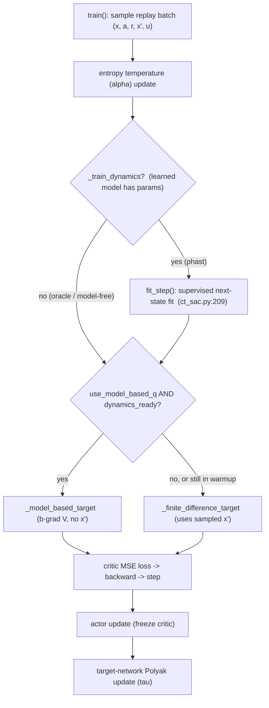
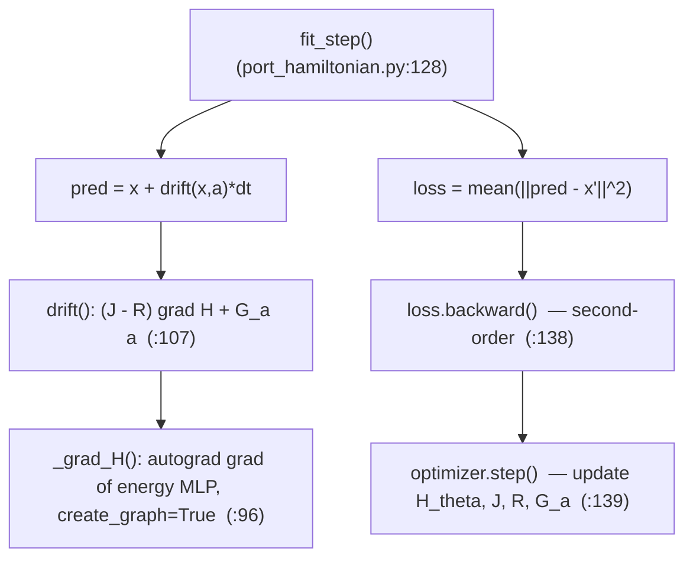

# CT-SAC Model-Based Extension — Implementation and Training Call Stack

:::info
**Summary.** This document describes the model-based extension of CT-SAC: a port-Hamiltonian dynamics model (`PortHamiltonianModel`) supplies the drift `b(x,a)`, which lets the critic target be computed from a *model* of the dynamics — the analytic generator $(\mathcal{L}^a V) = b\cdot\nabla V$ — instead of the model-free finite difference over a sampled successor state. It first explains how the dynamics model is implemented, then walks the modified training call stack, and finally contrasts the model-based and model-free paths. File/line references point to `algorithms/ct_sac.py` and `models/port_hamiltonian.py`.
:::

[TOC]

---

## 1. Context

CT-SAC trains a critic toward the continuous-time advantage-rate target

$$
q_V(x,a) = r(x,a) - \alpha\log\pi(a\mid x) + (\mathcal{L}^a V)(x) - \beta V(x),
\qquad
(\mathcal{L}^a V)(x) = b(x,a)\cdot\nabla V(x) + \tfrac12\mathrm{Tr}\!\big(\sigma\sigma^\top\nabla^2 V\big).
$$

The generator term $(\mathcal{L}^a V)$ depends on the dynamics $(b,\sigma)$. The extension introduces a learned or known model of $b$, controlled by two switches on `CTSAC`:

| Switch | Values | Meaning |
|---|---|---|
| `use_model_based_q` | `False` / `True` | off → model-free finite difference; on → model-based analytic generator |
| `dynamics_source` | `mujoco` / `phast` | exact simulator drift (oracle) vs. a learned port-Hamiltonian |

When `use_model_based_q=False`, none of the model machinery runs and the algorithm is the original CT-SAC.

---

## 2. How the dynamics model (PHAST) is implemented

The model lives in `models/port_hamiltonian.py` as `PortHamiltonianModel(nn.Module)`. It produces a **control-affine, port-Hamiltonian drift**

$$
b(x,a) = \big(J - R\big)\,\nabla H(x) + G_a\,a .
$$

### 2.1 Components

| Symbol | Code | Definition |
|---|---|---|
| Energy `H_θ(x)` | `self.energy` (`__init__`, line 73) | scalar MLP on the observation |
| `∇H(x)` | `_grad_H` (lines 96–103) | autograd gradient of `H_θ` |
| `J` (skew) | `_J` (lines 88–89) | `J = A − Aᵀ` from a free matrix `_J_raw` |
| `R` (PSD) | `_R` (lines 91–94) | `R = softplus(d₀)·I + L Lᵀ` (Householder low-rank) |
| `G_a` (port) | `self.G_a` | linear map `action → state` |

The skew `J` encodes conservative coupling, the PSD `R` encodes dissipation (so the flow is passive, `dH/dt ≤ 0`), and `G_a` injects the action. The drift is assembled in `drift()` (lines 107–117):

```python
gH = self._grad_H(x)        # ∇H(x)
JR = self._J() - self._R()  # (J − R)
return gH @ JR.t() + self.G_a(a)
```

All of `H_θ`, `_J_raw`, `d₀`, `L`, and `G_a` are learnable parameters of a **single, persistent** model instance, trained jointly by the same optimizer. `J` and `R` are **state-independent constant matrices** reconstructed from those parameters on every call (skew-by-construction and PSD-by-construction, respectively), so the drift's *state* dependence enters only through `∇H(x)` and its *action* dependence only through `G_a·a`. The model is **not** refit per timestep — it is updated incrementally by one gradient step per training iteration (see §3).

### 2.2 Two model sources

- **`mujoco` (oracle):** `drift()` calls a supplied `drift_fn` (`environment/dmc.py:dynamics_terms`) that returns the exact observation-space drift from the simulator. No trainable parameters.
- **`phast` (learned):** the structured drift above, with `H_θ, J, R, G_a` trained from data.

### 2.3 Fitting the learned model

`fit_step(obs, action, next_obs, dt, optimizer)` (lines 128–140) is one supervised step: it minimizes the one-step prediction error `‖(x + b·dt) − x'‖²` and updates the model parameters.

:::warning
**Relation to the PHAST paper.** This is a deliberately reduced, UNKNOWN-regime model: a generic energy MLP (not the separable `H = V(q) + ½pᵀM(q)⁻¹p`), a free skew `J` (not the canonical symplectic form), a constant `R` (not state-dependent `D(q)`), no velocity observer / canonicalizer (observations already contain velocities), forward-Euler one-step fitting rather than the paper's Strang splitting, and only the one-step data loss (no passivity / energy / rollout losses). It carries over the port-Hamiltonian *form* and its passivity-by-construction, not the full physical structure.
:::

---

## 3. The modified training call stack

`CTSAC.train()` runs the following once per gradient step. The model-based additions are the **dynamics update** and the **target selection**.



### 3.1 Dynamics update (ct_sac.py:209–214)

Runs only for a trainable model (`_train_dynamics=True`; the oracle has no parameters and is skipped):

```python
if self._train_dynamics:
    dynamics_loss = self.dynamics_model.fit_step(
        obs, actions, next_obs, dt, self.dynamics_optimizer)
    self._dynamics_updates += 1
```

The model has its **own optimizer** (`self.dynamics_optimizer`, built over the model's parameters in `__init__`, line 134) and is trained purely by supervised next-state prediction — **decoupled** from the critic/actor losses.

### 3.2 The `fit_step` sub-chain



Because the loss depends on `∇H` (the drift *is* a gradient of the energy), `loss.backward()` is a **second-order / double backward** — it differentiates through the autograd-computed `∇H` into the MLP weights, which is why `_grad_H` sets `create_graph=True`.

### 3.3 Warmup gate (ct_sac.py:219–220)

```python
dynamics_ready = (not self._train_dynamics) or (self._dynamics_updates >= self.dynamics_warmup)
```

A non-trainable oracle is ready immediately; a learned model is used only after `dynamics_warmup` fits. Until then the critic uses the finite-difference target, so the policy improves model-free-style while the model trains in the background.

### 3.4 Critic target, loss, actor, targets

After the target is selected, the remaining steps are unchanged from CT-SAC: regress all critics to `q_fast_target` (MSE), update the actor against the frozen critic, and Polyak-update the target networks.

---

## 4. Model-based vs. model-free: where the stacks diverge

The two paths are identical up to **target selection**; they differ only in how `q_fast_target` is produced.

| Aspect | Model-free | Model-based generator |
|---|---|---|
| Method | `_finite_difference_target` (ct_sac.py:291) | `_model_based_target` (ct_sac.py:315) |
| Needs sampled `x'`? | **Yes** | No |
| Uses dynamics model? | No | drift `b` + value gradient `∇V` |
| Uses `∇V`? | No | **Yes** |
| Extra cost | lowest | value gradient (+ model fit, if learned) |

**Model-free target** (finite difference over the sampled successor, rescaled time `u = dt/dt_default`):

$$
\text{target} = r + V(x) + \frac{\gamma^{u}\,\mathbb{E}_{a'}[\tilde Q(x',a')] - \mathbb{E}_a[\tilde Q(x,a)]}{u},
\qquad \tilde Q = Q_{\text{target}} - \alpha\log\pi .
$$

**Model-based generator** (first-order analytic generator; no `x'`):

$$
\text{target} = r + V(x) + \Big(\Delta t_{\text{default}}\cdot b(x,a)\cdot\nabla V(x) - \beta\,V(x)\Big).
$$

:::success
**Design rationale and limitation.** The generator removes the dependence on the sampled $x'$ and avoids the finite difference's $1/u$ variance blow-up at small/irregular $u$. Its cost is that it **linearizes** $V$ over an effective step $\lVert b\cdot dt\rVert$: the first-order term is only accurate when $\lVert b\cdot dt\rVert \ll$ the observation scale. For large-drift systems at normal control rates it is biased, so the generator helps specifically in the **small/irregular-$dt$, low-drift** regime; with $dt \approx \Delta t_{\text{default}}$ the model-free finite difference is already the exact soft-Bellman target.
:::

---

## 5. Implementation subtleties

- **Second-order backward.** The dynamics loss depends on `∇H`; training therefore differentiates through a gradient (`create_graph=True` in `_grad_H`). This is the dominant per-step cost of the learned model.
- **`enable_grad` in `_grad_H`.** Wrapping the gradient computation in `th.enable_grad()` lets `∇H` be taken even when the caller is under `th.no_grad()` (the critic target computation).
- **Decoupled losses.** The dynamics model is trained by supervised next-state prediction only; the critic and actor never backpropagate into it.
- **Rescaled-time convention.** The generator term uses `Δt_default·(b·∇V) − β·V` (with physical `b`), which matches the rescaled-time convention of the finite-difference target (`u = dt/dt_default`).

---

## 6. Empirical findings: drift magnitude and the timestep floor

These measurements (cheetah-run, observation $= [\,\text{position}(8),\ \text{velocity}(9)\,]$) determine when the model-based generator is usable.

**The drift is dominated by accelerations.** With $b = d(\text{obs})/dt = [\,\dot q\,;\ \ddot q\,]$, the median norms on random-action data are: velocity block $\lVert\dot q\rVert \approx 7$, acceleration block $\lVert\ddot q\rVert \approx 626$, so $\lVert b\rVert \approx 600$.

**Why $\lVert b\rVert$ is large — not contacts.** No-contact states have the same mean $\lVert\ddot q\rVert$ as contact states, and the correlation of $\lVert\ddot q\rVert$ with contact force is $\approx 0.02$. The cause is $\ddot q = M^{-1}(\tau - c(q,\dot q) - g(q))$ with (i) light limbs $\Rightarrow$ small inertia $\Rightarrow$ large $M^{-1}$, and (ii) large velocities (from vigorous exploration) $\Rightarrow$ large Coriolis/centrifugal $c \propto \dot q^{2}$.

$\lVert b\rVert$ scales with exploration vigor, but the *run* task forces high velocity regardless:

| random-action scale | $\lVert\dot q\rVert$ | $\lVert\ddot q\rVert$ | $\lVert b\rVert$ |
|---|---|---|---|
| 1.0 | 7.0 | 652 | 652 |
| 0.3 | 2.2 | 164 | 164 |
| 0.1 | 0.6 | 47 | 47 |

Gentler actions shrink $\lVert b\rVert$, but cheetah-run rewards forward speed, so the optimal policy operates at high velocity where $\lVert b\rVert$ is large — and the generator is evaluated at the policy's own states.

**The first-order generator is valid only for small $\lVert b\,\Delta t\rVert$.** The term $(b\cdot\nabla V)\,\Delta t$ approximates $V(x') - V(x)$ well only when the effective step is small relative to the observation scale ($\sim O(1)$). Correlation of the first-order estimate with the true value change:

| $\Delta t$ | $\lVert b\,\Delta t\rVert$ | corr(first-order, true $\Delta V$) |
|---|---|---|
| 0.001 (below floor) | $\approx 0.5$ | $\approx 0.82$ |
| 0.002 (physics floor) | $\approx 1.1$ | $\approx 0.82$ |
| 0.01 (benchmark) | $\approx 6$ | $\approx 0.2$ |
| 0.03 (benchmark max) | $\approx 18$ | $\approx 0.2$ |

**The physics floor is the obstacle.** The CT-RL paper's finest timestep for cheetah is $\Delta t_{\text{physics}} = 0.002$ (the MuJoCo model's native step is $0.01$). The generator's clean regime needs $\Delta t \lesssim 0.001$ — *below* the floor. So across the paper's entire legitimate control range $\Delta t \in [0.002, 0.03]$ the first-order step is biased; $\Delta t = 0.002$ is the borderline. Reaching the clean regime would require sub-physics-step control, which is not a valid configuration.

**Second-order does not rescue it.** Adding $\tfrac12 (b\,\Delta t)^\top \nabla^2 V (b\,\Delta t)$ leaves the correlation essentially unchanged ($0.818 \to 0.817$ at the floor) — the residual error is the dynamics step ($b\,\Delta t \neq x' - x$), not the curvature of $V$.

**Conclusion.** For cheetah the generator's valid regime ($\lVert b\,\Delta t\rVert \ll 1$) sits *below* the simulation's physics resolution, so it cannot be applied cleanly at legitimate timescales; the method suits genuinely low-drift / fine-timescale systems (e.g. the trading environment). The one legitimate borderline worth an empirical test is the floor $\Delta t = 0.002$, where the first-order correlation is $\approx 0.82$ when the critic is trained at that timescale.

---

## 7. Training stability: model-free contracts, the generator does not

Even at the legitimate floor $\Delta t = 0.002$ — where the first-order target is reasonably accurate (corr $\approx 0.82$, §6) — the model-based generator does **not** train stably. The cause is a property of the critic's value-iteration $V_{k+1} = T(V_k)$ (regress the critic to a bootstrapped target, then Polyak-update the target network): whether the backup operator $T$ is a **contraction**.

**Model-free — a $\gamma$-contraction.** The backup is the soft-Bellman operator
$$
(T_{\text{MF}}V)(x) = \mathbb{E}_a\big[\,r - \alpha\log\pi + \gamma\,\mathbb{E}[V(x')]\,\big],
$$
which satisfies $\lVert T_{\text{MF}}V_1 - T_{\text{MF}}V_2\rVert_\infty \le \gamma\,\lVert V_1 - V_2\rVert_\infty$: it **averages** $V$ over the next state (non-expansive) and scales by $\gamma < 1$. Banach's theorem then gives a unique fixed point and convergence. At the floor (uniform $\Delta t = \Delta t_{\text{default}}$) the finite-difference target reduces exactly to this Bellman backup.

**Generator — not a contraction.** The backup is
$$
(T_{\text{gen}}V)(x) = V(x) + \tau\big(\,r + b\cdot\nabla V - \beta V\,\big).
$$
The generator $b\cdot\nabla V$ is a **differential** operator (it acts on the *gradient* of $V$), not an expectation. Differential operators are not sup-norm contractions: $V_1$ and $V_2$ can be sup-norm-close yet have arbitrarily large gradient differences, so $b\cdot\nabla(V_1 - V_2)$ can *amplify* the difference — $\lVert T_{\text{gen}}V_1 - T_{\text{gen}}V_2\rVert_\infty$ can exceed $\lVert V_1 - V_2\rVert_\infty$. There is no Banach guarantee, so the iteration can oscillate or diverge. The CT-RL paper makes this explicit: it proves convergence "via new probabilistic arguments, sidestepping the challenge that **generator-based Hamiltonians lack Bellman-style contraction under the sup-norm**."

**Empirical confirmation** (oracle generator, 1M @ floor $\Delta t = 0.002$, eval on a regular 1000-step grid; the model-free arm was intentionally not run). The evaluation return oscillates without converging — repeatedly spiking toward ~100 and collapsing to ~1:

| step ($\times 10^3$) | 75 | 225 | 375 | 425 | 700 | 775 | 800 | 875 |
|---|---|---|---|---|---|---|---|---|
| eval return | 23 | 46 | 94 | 3 | 90 | 102 | 2 | 1 |

The peaks (~100) stay far below the discrete-time baseline (~850) and are never sustained; the final checkpoints collapsed to ~1. This is the non-contraction in action: the gradient-based backup — $\nabla V$ of an MLP, amplified by the large $\lVert b\rVert$ — has no contraction to damp perturbations, so the critic repeatedly enters and is ejected from good regions.

**Takeaway.** On cheetah the generator faces two compounding obstacles: (1) the first-order linearization is valid only *below* the physics floor (§6), and (2) even where the target is accurate, the value-iteration is **non-contractive** and does not converge. Model-free's Bellman backup is a $\gamma$-contraction and trains stably, so its stable, hundreds-scale learning is the known baseline — we did not run it here because the generator's instability is already the conclusive result.

---

## Appendix — file/line reference

| Item | Location |
|---|---|
| Dynamics optimizer construction | `algorithms/ct_sac.py:134` |
| Dynamics update (`fit_step` call) | `algorithms/ct_sac.py:209–214` |
| Warmup gate | `algorithms/ct_sac.py:219–220` |
| Target selection (generator / finite-difference) | `algorithms/ct_sac.py:223–232` |
| `_finite_difference_target` | `algorithms/ct_sac.py:291` |
| `_model_based_target` | `algorithms/ct_sac.py:315` |
| Energy MLP `H_θ` | `models/port_hamiltonian.py:73` |
| `_grad_H` (autograd `∇H`) | `models/port_hamiltonian.py:96–103` |
| `drift` (`(J−R)∇H + G_a a`) | `models/port_hamiltonian.py:107–117` |
| `fit_step` (loss / backward / step) | `models/port_hamiltonian.py:128–140` |
