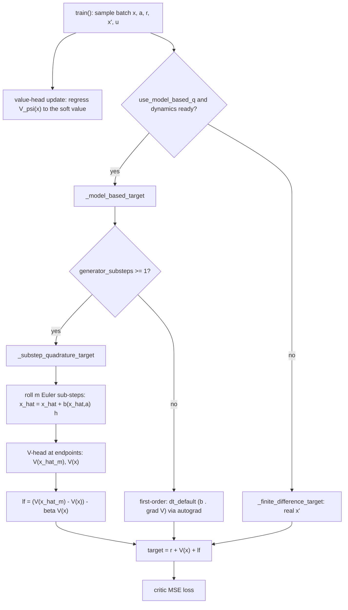

# CT-SAC Sub-Step Quadrature Generator — Setup and Call Stack

:::info
**Summary.** This document describes a model-based critic target for CT-SAC that estimates the value change over the control interval by a **sub-step quadrature** of the dynamics model, read directly from the decoupled value head. The dynamics model is rolled $m$ Euler sub-steps over the nominal interval, the scalar $V$-head is evaluated at the rolled endpoint, and the value change is taken as a finite difference of $V$ over the predicted states — with no autograd gradient. It is the multi-point generalization of the first-order generator $\Delta t_{\text{default}}\,(b\cdot\nabla V)$ and of the single-step finite difference $V(x+b\,\Delta t_{\text{default}}) - V(x)$. The estimator is controlled by `generator_substeps` on `CTSAC` and is built and validated on `cartpole-swingup`, a smooth system where the learned drift fits well. Background lives in `docs/ct_sac_model_based_call_stack.md` (the first-order generator §6, target variance §7, the $V$-head §9).
:::

[TOC]

---

## 1. Context and motivation

The CT-SAC critic target needs the generator term $(\mathcal{L}^a V)(x) = b(x,a)\cdot\nabla V(x)$ (drift only, $\sigma=0$), which is the instantaneous rate of change of $V$ along the dynamics.

The first-order model-based target evaluates that rate at the current state and scales it by the nominal step: $\Delta t_{\text{default}}\,(b\cdot\nabla V)$, with $\nabla V$ obtained by autograd of the value network (`docs/ct_sac_model_based_call_stack.md` §6). Two limitations of that form motivated this estimator.

The first is accuracy. The true drift-induced value change over the control interval is an integral of the rate along the trajectory, and a single-point sample of that rate carries an $O(\Delta t^2)$ truncation error that grows with the effective step $\lVert b\,\Delta t\rVert$ (§6). Evaluating the rate at more points along the model orbit reduces that error.

The second is the value gradient. The first-order term reads $\nabla V$ from autograd of the value network, which is rough and (without the $V$-head) carries action-sampling noise (§9). Differencing the value over states replaces the gradient with two clean scalar evaluations of the decoupled $V$-head.

This estimator addresses both by integrating the rate as a finite difference of the $V$-head over model-predicted sub-states.

---

## 2. The estimator

The drift-induced value change over the nominal interval $\Delta t_{\text{default}}$ is the integral of the rate along the model orbit:

$$
V(x') - V(x) \;=\; \int_0^{\Delta t_{\text{default}}} (\mathcal{L}^a V)\big(x(s)\big)\,ds,
\qquad \dot x(s) = b\big(x(s),a\big).
$$

The first-order generator approximates this with the left-endpoint rule, $(\mathcal{L}^a V)(x_0)\,\Delta t_{\text{default}} = \Delta t_{\text{default}}\,(b\cdot\nabla V)$, which is one rate sample.

The sub-step quadrature instead rolls the model $m$ Euler sub-steps of size $h = \Delta t_{\text{default}}/m$ and reads the value change from the $V$-head at the endpoints:

$$
\hat x_0 = x,\qquad \hat x_{k+1} = \hat x_k + b(\hat x_k, a)\,h,\qquad
\boxed{\;\ell_f = \big(V(\hat x_m) - V(x)\big) - \beta\,V(x)\;}
$$

and the critic target is $\text{target} = r + (1-\text{done})\,(V(x) + \ell_f) = r + V(\hat x_m) - \beta V(x)$.

The change of $V$ along the rolled orbit, $V(\hat x_m) - V(x)$, is the telescoped sum of the sub-step changes, so it is the finite-difference reading of $\int (\mathcal{L}^a V)\,ds$ over the predicted trajectory. No autograd gradient is taken; the value gradient and its curvature enter through the finite difference of the (clean, state-only) $V$-head.

**Two limits and what each captures.**

| `generator_substeps` $m$ | estimator | captures |
|---|---|---|
| 0 | $\Delta t_{\text{default}}\,(b\cdot\nabla V) - \beta V$ (autograd) | first-order rate at $x$ |
| 1 | $\big(V(x + b\,\Delta t_{\text{default}}) - V(x)\big) - \beta V$ | value change along one Euler step (curvature along $b\,\Delta t_{\text{default}}$ included) |
| $m > 1$ | $\big(V(\hat x_m) - V(x)\big) - \beta V$ | value change along the $m$-sub-step orbit (reduced Euler error in $\hat x_m$) |

The $m=1$ case is the single-Euler-step finite difference over states: it already captures the curvature the first-order autograd term drops, because $V(x + b\,\Delta t_{\text{default}}) - V(x) = \Delta t_{\text{default}}(b\cdot\nabla V) + \tfrac12 (b\,\Delta t_{\text{default}})^\top \nabla^2 V (b\,\Delta t_{\text{default}}) + \cdots$. Larger $m$ refines the rolled endpoint toward the true model flow (Euler error $O(1/m)$), which matters when $\lVert b\,\Delta t_{\text{default}}\rVert$ is not small.

:::warning
**Discount convention (a simplification).** The discount is kept as the single lump $-\beta V(x)$, matching the first-order target's $\Delta t_{\text{default}}(b\cdot\nabla V) - \beta V$ structure. A fuller treatment would discount each sub-step along the orbit. The drift contribution is the part the quadrature refines.
:::

:::info
**Why the $V$-head matters here.** $V$ is read from the decoupled state-only head $V_\psi$ (`docs/ct_sac_model_based_call_stack.md` §9), so $V(\hat x_m)$ and $V(x)$ are clean scalar evaluations with no action sampling. The whole estimator runs under `th.no_grad()`; the target is deterministic given the batch (verified sample-free). Without the $V$-head it falls back to the sampled $\mathbb{E}_a[\tilde Q]$ at the rolled state, which reintroduces action-sampling noise.
:::

---

## 3. Setup on cartpole

`cartpole-swingup` is the validation target: a smooth, contact-free system where the learned port-Hamiltonian drift fits well (drift corr $\approx 0.83$, one-step MSE well below the no-op baseline; `docs/port_hamiltonian_ct_sac.md` M1). The model-predicted sub-states $\hat x_k$ are therefore trustworthy, which is the regime where rolling the model to read the value change is sound.

The runs use a uniform timestep $\Delta t = \Delta t_{\text{default}} = 0.01$ (so $u = 1$, the model orbit over the nominal interval matches the actual transition span), the $V$-head enabled, and the learned `phast` drift. Three modes isolate the contribution of the quadrature:

| Mode (`cartpole-swingup`) | target | dynamics | `generator_substeps` |
|---|---|---|---|
| `mf` | model-free finite difference | — | — |
| `mbq_phast` | first-order generator $\Delta t_{\text{default}}(b\cdot\nabla V)$ | learned `phast` + $V$-head | 0 |
| `mbq_quad` | sub-step quadrature | learned `phast` + $V$-head | 4 |

All three share the same env, critic architecture, and optimizer; the critic target is the only difference. `mbq_phast` vs `mbq_quad` isolates the quadrature against the first-order autograd generator; `mf` is the contractive baseline.

---

## 4. The modified call stack

The quadrature branch is entered at the top of `_model_based_target` when `generator_substeps >= 1`, and returns `_substep_quadrature_target` directly. The rollout calls `dynamics_model.drift` at each predicted sub-state and `_state_value` (the $V$-head when ready) at the endpoints. The first-order autograd path (`generator_substeps = 0`) and the gated-blend / diffusion terms are untouched.

---

## 5. What is being tested

**Unit level (in `tests/test_model_based_generator.py::TestSubstepQuadrature`).**

| Test | Claim |
|---|---|
| `test_m1_matches_finite_difference_over_states` | $m=1$ reproduces $V(x + b\,\Delta t_{\text{default}}) - V(x) - \beta V(x)$ exactly |
| `test_target_finite_and_sample_free` | $m=4$ target is finite, shape $(B,1)$, and identical across RNG seeds (no action sampling) |
| `test_substeps_reduce_integration_error` | on a linear drift, target$(m{=}8)$ is closer to a fine reference target$(m{=}128)$ than target$(m{=}1)$ |

The integration property is clean: on a linear system $\dot x = Ax$ with $\lVert A\,\Delta t\rVert \sim O(1)$, the Euler-rolled endpoint converges to the exact flow $e^{A\Delta t}x$ with error halving each time $m$ doubles ($O(1/m)$).

**End-to-end (the open question, the `cartpole-swingup` modes).** Whether the curvature-inclusive, autograd-free quadrature target tracks the true value change better than the first-order autograd generator, and whether that improves learning on a smooth system where the model is accurate. The comparison is `mf` vs `mbq_phast` vs `mbq_quad` over seeds, judged on matched-step return and the logged `train/fraction`.

:::success
**Expected reading.** On cartpole the learned drift is accurate and the dynamics are smooth, so the rolled sub-states are reliable and the quadrature should track $V(x') - V(x)$ at least as well as the first-order generator, with the gap widening at larger effective steps. This is the regime the estimator is designed for.
:::

---

## 6. Scope and limits

The quadrature reduces the integration (truncation) error of the model-based target and removes the autograd value gradient. Its accuracy is bounded by the dynamics model: every predicted sub-state $\hat x_k$ is a model output, so on contact-rich systems (cheetah, humanoid) the rolled states go off-distribution and inherit the model's contact inaccuracy (`docs/ct_sac_model_based_call_stack.md` §6; the dyna collapse). The estimator is therefore matched to smooth, accurate-model regimes — cartpole here, and the trading SDE.

The real successor $x'$ is already available in the batch, and $V_\psi(x') - V_\psi(x)$ is the exact, sample-free value change for the actual transition. The model-rolled endpoint $\hat x_m$ adds value beyond that for variance reduction under stochasticity ($\sigma \neq 0$), for evaluation at off-sample actions, and for sub-control-step resolution the environment does not return. In the deterministic uniform-$\Delta t$ cartpole setup the main quantity being checked is whether the quadrature recovers the value change the first-order generator approximates.

The estimator leaves the value-iteration's contraction properties unchanged (`docs/ct_sac_model_based_call_stack.md` §7.2): differencing $V$ over the real $x'$ is the contractive model-free backup, while the model-based quadrature relies on the rolled $\hat x_m$ and so inherits the generator's stability properties. Leaning on the real $x'$ moves it toward the contractive backup; leaning on $\hat x_m$ moves it toward the generator.

---

## Appendix — file/line reference

| Item | Location |
|---|---|
| `generator_substeps` parameter | `algorithms/ct_sac.py` `CTSAC.__init__` |
| Quadrature branch | `algorithms/ct_sac.py` `_model_based_target` (early return on `generator_substeps >= 1`) |
| `_substep_quadrature_target` (rollout + endpoints) | `algorithms/ct_sac.py` |
| $V$-head read at endpoints | `algorithms/ct_sac.py` `_state_value` (→ `model.target_value`) |
| Drift at sub-states | `models/port_hamiltonian.py` `drift` |
| Modes (`mf`, `mbq_phast`, `mbq_quad`) | `benchmarks/hyperparams/ct_sac.csv` (`cartpole-swingup`, `algo_generator_substeps`) |
| Tests | `tests/test_model_based_generator.py::TestSubstepQuadrature` |
