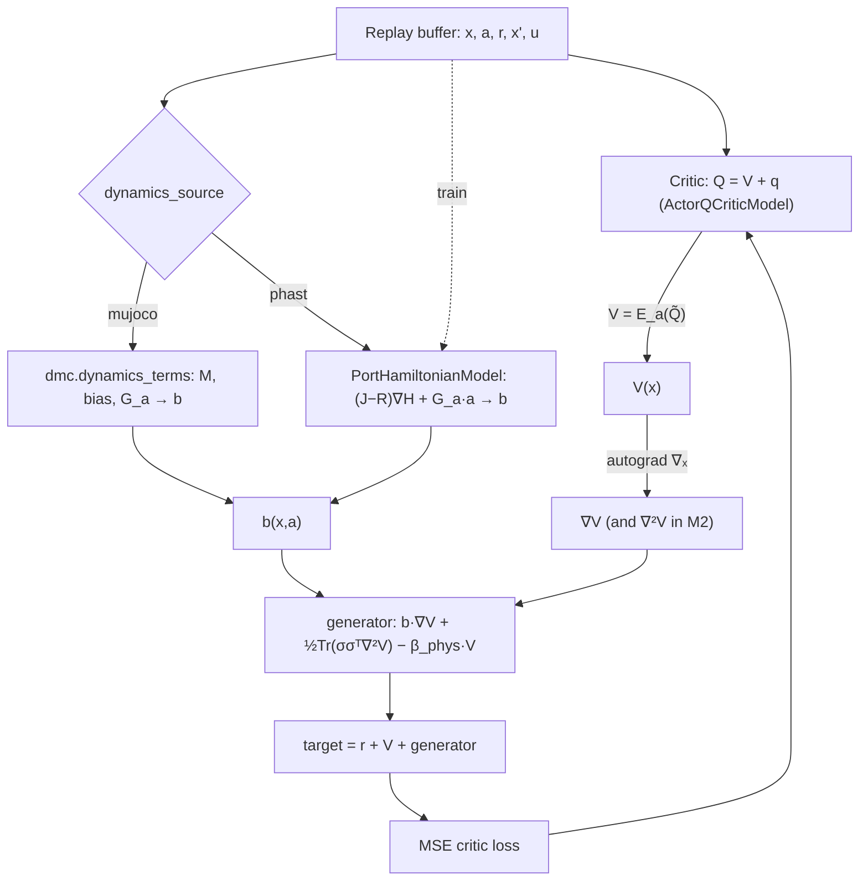

# Model-Based Generator Estimation for Continuous-Time SAC via a Port-Hamiltonian Dynamics Model

:::info
**Summary.** This document specifies a design that replaces the model-free, sample-based estimation of the continuous-time advantage-rate function $q$ in CT-SAC with a model-based evaluation of the stochastic generator. A port-Hamiltonian dynamics model supplies the drift $b$ — the "$b$ term" of Eq. 6 — so that the generator $(\mathcal{L}^a V)$ can be evaluated analytically, removing the dependence on a sampled successor state. The port-Hamiltonian is obtained either from the simulator (MuJoCo) or learned with PHAST. The initial implementation targets `cheetah-run`, validates the analytic generator against the existing finite-difference estimator, and defers the diffusion (noise) term to a later milestone.
:::

[TOC]

---

## 1. Context and motivation

### 1.1 The continuous-time reinforcement learning setting

The controlled system is modeled as an Itô stochastic differential equation (paper Eq. 4), where $b$ is the drift and $\sigma$ the diffusion:

$$
dX_t = b(X_t,a_t)\,dt + \sigma(X_t,a_t)\,dW_t ,\qquad X_0\sim\mu.
$$

The controlled infinitesimal generator (paper Eq. 6) is the continuous-time analogue of the one-step Bellman drift:

$$
(\mathcal{L}^a V)(x) \;=\; \underbrace{b(x,a)\cdot\nabla V(x)}_{\text{drift term ("}b\text{ term")}} \;+\; \underbrace{\tfrac12\,\mathrm{Tr}\!\big(\sigma(x,a)\,\sigma(x,a)^\top\,\nabla^2 V(x)\big)}_{\text{diffusion term}} .
$$

The quantity CT-SAC requires is the instantaneous advantage-rate $q$ (paper Eq. 164), which restores the action dependence that the discrete-time $Q$ loses as $\Delta t\to 0$:

$$
\boxed{\,q_V(x,a) \;=\; r(x,a)\;-\;\alpha\log\pi(a\mid x)\;+\;(\mathcal{L}^a V)(x)\;-\;\beta\,V(x)\,}\tag{Eq. 18 / 164}
$$

This characterization is exact but not model-free: the generator $(\mathcal{L}^a V)$ depends on the unknown dynamics $b$ and $\sigma$.

### 1.2 The current estimator

CT-SAC sidesteps the unknown dynamics by replacing the generator with a short-horizon value increment over a *sampled* successor state $X_{t+u}$ (paper Eq. 166). Writing $V(x):=\mathbb{E}_{a\sim\pi}[\tilde Q(x,a)]$ with $\tilde Q = Q_{\text{target}}-\alpha\log\pi$, this is implemented as follows:

```python
# algorithms/ct_sac.py:212-219  (model-free, current)
dt *= self.time_rescale                                  # u in units of dt_default
gamma_dt = th.exp(-self.beta * dt)                       # e^{-beta*u}
fraction = (gamma_dt * E_next - E_curr) / (dt + 1e-8)    # ≈ (L^a V - beta V)
target   = rewards + (1 - dones) * (E_curr + fraction)   # = r + V + (L^a V - beta V)
```

Here `E_curr` $=\mathbb{E}_a[\tilde Q(x,a)]\approx V(x)$ and `E_next` $=\mathbb{E}_{a'}[\tilde Q(x',a')]\approx V(x')$. That the `fraction` term estimates $(\mathcal{L}^a V)(x)-\beta V(x)$ follows from Dynkin's formula:

$$
\frac{d}{du}\Big(e^{-\beta u}\,\mathbb{E}\!\left[V(X_{t+u})\mid X_t=x,\,a_t=a\right]\Big)\Bigg|_{u=0}
= (\mathcal{L}^a V)(x) - \beta V(x).
$$

The `fraction` is therefore a finite-difference estimate of the generator at step size $u$.

:::warning
**Limitation.** This estimator (i) requires the sampled successor state $x'$ and (ii) incurs $\mathcal{O}(u^2)$ discretization bias together with $\mathcal{O}(1/u)$ variance (paper Thm. 4.2: $\lVert \tilde q^u_V - q_V\rVert_\infty \le \tfrac{L}{u}\lVert V_k-V^\star\rVert_\infty + C_2 u^2$), which motivates Richardson extrapolation (Eq. 29) to remain stable.
:::

### 1.3 Proposed approach

The proposal is to evaluate the generator analytically using a *model* of the dynamics. The model is a port-Hamiltonian system (PHAST Eq. 1) whose drift is control-affine in the agent action:

$$
b(x,a) = (J - R)\,\nabla H(x) + G_a\,a ,\qquad \sigma(x) = \text{exogenous stochasticity (deferred; see §3.4).}
$$

With $b$, $\sigma$, and autodifferentiated derivatives of $V$, the generator is computed without sampling a successor state. Equivalently, the agent gains a model of how the state evolves at the current $(x,a)$ without rolling the environment forward.

:::success
**Anticipated benefits.** (1) *Sample efficiency and stability* — the high-variance, biased finite difference is replaced by an exact (or low-bias, model-based) target. (2) *Robustness* — the diffusion term $\tfrac12\mathrm{Tr}(\sigma\sigma^\top\nabla^2V)$ acts as a value-smoothing regularizer (later milestone). (3) *Analytic policy improvement* — the control-affine drift makes $\partial q/\partial a$ closed-form (optional actor upgrade).
:::

### 1.4 Scope and adopted decisions

| Question | Decision |
|---|---|
| First target environment | **`cheetah-run`** — its observation is a near-canonical $[\,q,\dot q\,]$ phase space |
| Dynamics source | **Validate, then learn** — a MuJoCo-derived "known" drift as an oracle, followed by a PHAST-learned drift |
| Noise $\sigma$ | **$\sigma=0$ in v1**, then noise via the fluctuation–dissipation relation $\sigma\sigma^\top = 2T\,D(q)$, tied to PHAST's learned damping $D$ |

---

## 2. The algorithmic change

Let $V(x):=\mathbb{E}_{a\sim\pi}[\tilde Q(x,a)]$, which is the quantity `expectation_q_tilde_current` already computed at `ct_sac.py:206`.

### 2.1 Critic target: current versus proposed

The current model-free target requires the sampled successor state $x'$:

$$
\text{target} \;=\; r + V(x) + \frac{e^{-\beta u}\,V(x') - V(x)}{u}.
$$

The proposed model-based target (v1, with $\sigma=0$) requires only the model and the current state:

$$
\boxed{\;\text{target} \;=\; r + V(x) + \Big(\,\underbrace{b(x,a)\cdot\nabla_x V(x)}_{=\;(J-R)\nabla H\cdot\nabla V \,+\, (G_a a)\cdot\nabla V} \;-\; \beta_{\text{phys}}\,V(x)\Big)\;}
$$

The diffusion contribution $\tfrac12\mathrm{Tr}(\sigma\sigma^\top\nabla^2 V)$ is zero in v1 and is introduced in Milestone M2.

### 2.2 Time-unit consistency

This is the most error-prone detail and warrants explicit treatment. The drift $b=\dot x$ is expressed in physical seconds, whereas the discount in the code, $\beta=-\log\gamma$, is expressed in rescaled time (`ct_sac.py:212`, `dt *= self.time_rescale`, where `time_rescale` $=1/\Delta t_{\text{default}}$ from `algorithms/base.py`). Consistency requires the per-second discount rate paired with the physical drift:

$$
\beta_{\text{phys}} \;=\; \frac{\beta}{\Delta t_{\text{default}}} \;=\; \frac{-\log\gamma}{\Delta t_{\text{default}}}.
$$

As a check, $e^{-\beta\,u/\Delta t_{\text{default}}} = \gamma^{\,u/\Delta t_{\text{default}}}$, confirming that the per-second discount rate is $\beta/\Delta t_{\text{default}}$ (the code's `beta * time_rescale`).

### 2.3 Computing the value gradient (and Hessian)

Version 1 retains `ActorQCriticModel` and obtains $V$ and $\nabla V$ by automatic differentiation, requiring no new critic class:

```python
obs.requires_grad_(True)
V  = expectation_q_tilde_current                             # E_a[min-Q_target - alpha*log pi]
gV = th.autograd.grad(V.sum(), obs, create_graph=False)[0]   # ∇_x V
b  = dynamics_model.drift(obs, actions)                      # (J - R)∇H + G_a·a
Lf = (b * gV).sum(-1, keepdim=True) - beta_phys * V          # (L^a V - beta V), sigma = 0
target = (rewards + (1 - dones) * (V + Lf)).detach()
loss   = sum(F.mse_loss(q, target) for q in model.q_values(obs, actions))
```

For Milestone M2, the diffusion term is computed via per-channel Hessian–vector products, which require `create_graph=True` on `gV` and scale with the number of noise channels $k$:

$$
\tfrac12\,\mathrm{Tr}(\sigma\sigma^\top\nabla^2 V) \;=\; \tfrac12\sum_{i} \sigma_i^\top(\nabla^2 V)\,\sigma_i,
\qquad (\nabla^2 V)\sigma_i = \nabla_x\big(\nabla_x V\cdot\sigma_i\big).
$$

:::info
**Optional refinement.** If the gradient of $\mathbb{E}_a[\text{min-}Q]$ proves too noisy — it differentiates through both the twin-minimum and the policy — an explicit scalar $V$-head with its own target network is recommended, reusing the `v_net`/`value()` pattern in `models/coupled_vq.py:53-58,127-129`. This yields clean MLP derivatives for both $\nabla V$ and $\nabla^2 V$ and is advisable before enabling M2.
:::

### 2.4 Reward dependence and the actor

The action enters the generator linearly: $(\mathcal{L}^a V)(x) = [(J-R)\nabla H(x)]\cdot\nabla V + a^\top G_a^\top\nabla V + \tfrac12\mathrm{Tr}(\cdots)$. The reward's action dependence $r(x,a)$ is not modeled — the environment reward is treated as a black box — so the learned critic head continues to absorb it; the model improves the dynamics component of the target, not the reward component. The actor update (`ct_sac.py:232-243`, maximizing $\min_i Q_i(x,a_\pi)-\alpha\log\pi$) is unchanged in v1. Exploiting the closed-form gradient $\partial q/\partial a = \partial r/\partial a + G_a^\top\nabla V$ for analytic policy improvement is recorded as a future option.

---

## 3. The port-Hamiltonian dynamics model

### 3.1 Formulation

The port-Hamiltonian form (PHAST Eq. 1), with phase state $x=(q,p)$, is:

$$
\dot x = (J - R)\,\nabla H(x) + G u,\qquad H(q,p)=V(q)+\tfrac12 p^\top M(q)^{-1}p,
$$
$$
J=\begin{pmatrix}0&I\\-I&0\end{pmatrix}\ (\text{skew}),\qquad
R=\begin{pmatrix}0&0\\0&D(q)\end{pmatrix},\quad D(q)=D(q)^\top\succeq0 .
$$

The structure is passive by construction, $\dot H = -\nabla H^\top R\,\nabla H \le 0$ (PHAST Eq. 4). Damping is parameterized by a Householder-style low-rank positive-semidefinite expansion (PHAST Eq. 10):

$$
D(q)=d_0 I + \sum_{i=1}^{r}\beta_i(q)\,k_i(q)k_i(q)^\top,\qquad d_0\ge0,\ \beta_i\ge0,\ \lVert k_i\rVert=1 .
$$

PHAST defines three knowledge regimes (PHAST Table 1): KNOWN ($V,M$ given, $D$ learned), PARTIAL ($V=\bar V+\varepsilon\hat V$, $M$ given, $D$ learned with a bound), and UNKNOWN ($V,M,D$ all learned). Integration uses Strang splitting (PHAST Alg. 1) for structure preservation; the constant-mass approximation $M(q)\approx M$ is adopted initially.

### 3.2 Forced form: where the action enters

PHAST §3.5 (Eq. 19) gives the controlled plant $\dot x=(J_p-R_p)\nabla H_p + G_p u_p$ with port output $y_p=G_p^\top\nabla H_p$. In the present setting the agent action is the control input, $u_p=a$, entering through the agent port $G_a$:

$$
b(x,a) = (J-R(x))\,\nabla H(x) + G_a\,a .
$$

### 3.3 Known versus learned dynamics

The known (oracle) drift is obtained from MuJoCo through the existing `self._env.physics` handle (`environment/dmc.py`): the state $(q,\dot q)$ is reconstructed from the observation, the control is set to $a$, `mj_forward` is invoked, and $\ddot q$ is read from `data.qacc` — an exact result. For training-time efficiency, the analytic control-affine form $\ddot q = M^{-1}(G_a a - c)$ may be used instead, with $M$ from `mj_fullM`, the bias $c$ from `data.qfrc_bias`, and $G_a$ from `data.actuator_moment`. The learned drift (PHAST) is fitted from replay transitions, as described in §6.

### 3.4 The diffusion term

:::info
**Can PHAST learn the noise?** Standard PHAST learns the drift only — it is a deterministic ordinary differential equation whose sole energy-loss channel is the damping $R$. Moreover, MuJoCo is deterministic, so the one-step residual $\Delta x - b\,\Delta t \approx 0$, and there is no genuine diffusion in the data to identify. The diffusion $\sigma$ is therefore a modeling choice. Three routes are available.
:::

1. **Specification.** Set $\sigma=G_h\sqrt{\text{intensity}}$, placing noise on the velocity degrees of freedom and exposing a single intensity hyperparameter.
2. **Fluctuation–dissipation (the "learned-via-PHAST" route).** For a Langevin/thermal port-Hamiltonian, $\sigma\sigma^\top = 2T\,D(q)$. Because PHAST learns $D$, the noise covariance is fixed by the learned damping up to a single temperature $T$, and is physically consistent in that the noise acts where the dissipation acts. This is the adopted v1→v2 path.
3. **Direct estimation.** Estimate $\sigma\sigma^\top(x,a)=\mathrm{Cov}(\Delta x - b\,\Delta t\mid x,a)/\Delta t$ from data — meaningful only where the process is genuinely stochastic, e.g. the trading environment, in which $dX=b\,dt+\sigma\,dW$ is the standard model and $\sigma$ is the volatility. This is a "stochastic PHAST" extension and is deferred to Milestone M3.

The generator's diffusion term $\tfrac12\mathrm{Tr}(\sigma\sigma^\top\nabla^2 V)$ functions as a value-smoothing (risk) regularizer: the critic averages $V$ over a local neighborhood, biasing the policy toward locally flat, robust regions of the value surface.

---

## 4. State-space mapping

The generator requires $V$ and the dynamics to be expressed on the same state. The observation of `cheetah-run` is a near-canonical phase space, so the observation-space drift is exact and requires no Jacobian (`docs/env_data_notes.md:54-69`; $n_q=n_v=9$, planar so coordinates are index-aligned, with the absolute $x$-coordinate $q_0$ dropped for translation invariance):

$$
\text{obs} = [\,q_{1:9}\,(8)\;;\; \dot q_{0:9}\,(9)\,],\qquad
\frac{d}{dt}\,\text{obs}_{0:8} = \dot q_{1:9} = \text{obs}_{9:17},\qquad
\frac{d}{dt}\,\text{obs}_{8:17} = \ddot q = M^{-1}\!\big(G_a a - c\big).
$$

The dropped coordinate $q_0$ never enters because the observation is invariant to it. This property is the reason `cheetah-run` was selected as the v1 target.

:::warning
**Generalization caveat.** The 67-dimensional observation of `humanoid-walk` omits the root configuration, so a canonical phase space $(q,p)$ is unavailable; only a learned-on-observation port-Hamiltonian (UNKNOWN regime) applies, and the physical structure is approximate. This generalization is deferred to Milestone M3.
:::

---

## 5. Architecture and data flow



---

## 6. Implementation plan

### 6.1 New files

| File | Purpose |
|---|---|
| `models/port_hamiltonian.py` | `PortHamiltonianModel(Model)` exposing `drift(x,a) -> (B,d)` and `diffusion(x) -> (B,d,k)`; a scalar energy $H$ (an MLP, or a separable form), a skew $J$, a Householder positive-semidefinite $R(x)$ (Eq. 10), and an agent port $G_a$. Regimes UNKNOWN/PARTIAL initially, with a constant-mass approximation. Reuses `common/torch_layers.create_mlp` and the `models/base.Model` interface. |
| `algorithms/phast_trainer.py` *(or a `fit_step` method)* | Fits $H$, $R$ (and optionally $M$) from replay transitions using the PHAST $\mathcal{L}_{\text{data}}$ (one-step) objective, optionally augmented with $\mathcal{L}_{\text{pass}}$, $\mathcal{L}_{\text{energy}}$, and $\mathcal{L}_{\text{roll}}$ (PHAST Eqs. 13–18). The velocity observer is omitted because the cheetah observation already contains $\dot q$. The model is pretrained offline and then fine-tuned online against a lagged copy. |

### 6.2 Modified files

| File | Change |
|---|---|
| `algorithms/ct_sac.py` | Replace the target block (`:164-219`) with a branch on a `use_model_based_q` flag: the model-based generator target (§2) or the current finite difference, which is retained as a fallback. Add the constructor arguments `use_model_based_q=False`, `dynamics_model=None`, `dynamics_source="mujoco"\|"phast"`, and `human_input_intensity=0.0`. Log the model-based and finite-difference values of `fraction` for the oracle diagnostic. |
| `environment/dmc.py` | Add a read-only `dynamics_terms(obs, action)` helper that exposes MuJoCo physics via `self._env.physics`: reconstruct $q,\dot q$, call `mj_forward`, and read `data.qacc` (or, for the analytic form, `mj_fullM`, `qfrc_bias`, and `actuator_moment`). |
| `benchmarks/run_ct_rl.py` | Construct and inject the dynamics model, and thread through the new flags. |
| `benchmarks/hyperparams/ct_sac.csv` | Add the columns `algo_use_model_based_q`, `algo_dynamics_source`, and `algo_human_input_intensity`, together with the PHAST architecture columns. |

### 6.3 Components reused without modification

The `v_net`/`value()` pattern in `models/coupled_vq.py` supports the optional explicit $V$-head; `models/actor_q_critic.py` (twin-$Q$, target networks, and the `act` / `q_values` / `target_min_q` / `soft_update_targets` API) remains the v1 critic backbone; and `common/torch_layers.create_mlp` together with `models/base.Model` are reused directly.

---

## 7. Milestones

- [x] **M0 — plumbing and oracle ($\sigma=0$, known/MuJoCo).** *(done.)* Generator-target path added behind `use_model_based_q`; $b$ obtained from `dmc.dynamics_terms`. The implementation uses the rescaled-time form $\texttt{dt_default}\cdot(b\cdot\nabla V)-\beta V$ (equivalent to $b\cdot\nabla V-\beta_{\text{phys}}V$) to match the finite-difference convention. Validated: drift and generator both track the simulator at small dt (corr $\approx 1.0$). The ~20% gap at dt $= 0.01$ is MuJoCo's Euler **implicit-damping discretization bias** (the realized increment is attenuated relative to the continuous `qacc`); the ratio $\to 1$ as dt $\to 0$ — exactly the $\mathcal{O}(u)$ bias the model-based approach removes.
- [x] **M1 — learned drift (PHAST).** *(done.)* `PortHamiltonianModel` (phast mode) is fit online from the replay buffer inside CT-SAC — warmup under the finite-difference target, then takeover (`dynamics_warmup`); `dynamics_source="phast"` wired into the runner. Validated: strong fit on smooth systems (cartpole drift corr $\approx 0.83$, one-step MSE $\approx 0.32\times$ the no-op baseline). Contact-rich cheetah is markedly harder (beats no-op, drift corr $\approx 0.37$) — the stiff, near-discontinuous contact accelerations are the bottleneck. Richer fit (on-policy data, contact features, state-dependent $D(q)$, Strang substeps) is future work.
- [ ] **M2 — diffusion via fluctuation–dissipation.** Set $\sigma\sigma^\top=2T\,D(q)$ from the learned damping $D$, enable the Hessian-vector-product term, and study $T$ as a robustness parameter.
- [ ] **M3 — extensions.** Directly learned $\sigma$ (volatility) on the trading environment, and generalization to `humanoid-walk` (learned-on-observation only).

---

## 8. Verification

1. **Oracle equivalence (primary test).** With the MuJoCo drift, assert per batch that $\text{mean}\,\big|\,b\cdot\nabla V-\beta_{\text{phys}}V-\text{fraction}_{\text{FD}}\,\big|$ is small and tends to zero as $u\to0$, via a standalone script under `tests/`.
2. **Model fidelity.** Report one-step error $\lVert x'-(x+b\,u)\rVert$ on held-out transitions, together with energy and passivity diagnostics.
3. **End-to-end performance.** Compare `cheetah-run` learning curves over twelve seeds (`evaluations/performance_report.py`) for the model-based variant against the baseline CT-SAC; the expectation is comparable or improved return with reduced critic-target variance (compare the logged `train/fraction` against the model-based generator).
4. **Ablations.** Vary `dynamics_source` over `{mujoco, phast}`, toggle $\sigma$ (M2), and sanity-check the $\beta_{\text{phys}}$ unit handling.

---

## 9. Risks and mitigations

| Risk | Mitigation |
|---|---|
| Critic-gradient noise amplified by $b\cdot\nabla V$ (MLP value gradients are rough) | Use the explicit $V$-head (`coupled_vq` pattern); apply spectral normalization or a smoothness penalty; clip gradients; decide after the M0 curves |
| Time-unit error ($\beta$ versus $\beta_{\text{phys}}$; physical versus rescaled $b$) | The oracle-equivalence test is designed to detect this, as any mismatch inflates the check |
| State mapping beyond cheetah | Restrict to the learned-on-observation (UNKNOWN) regime for humanoid and quadruped; out of v1 scope (M3) |
| Online model nonstationarity (M1) | Pretrain and use a lagged model copy; gate the model-based target behind a "model warmed up" check, otherwise fall back to the finite difference |
| Identifiability and gauge freedom (PHAST §4.1.2) | The generator requires only $b\cdot\nabla V$ to be accurate, not identifiable parameters, so a forecasting-grade PHAST model suffices |
| Cost of the MuJoCo oracle (per-sample `mj_forward`) | Acceptable for M0 validation; use the analytic $M^{-1}(G_a a-c)$ form if the known model is trained at scale |

---

## Appendix — symbol reference

| Symbol | Meaning |
|---|---|
| $X_t,\,x$ | State (here, the RL observation) |
| $a$, $u$ (PHAST) | Agent action / control input |
| $b(x,a)$ | SDE drift, $(J-R)\nabla H + G_a a$ |
| $\sigma(x)$ | SDE diffusion (exogenous stochasticity) |
| $\mathcal{L}^a$ | Controlled infinitesimal generator (Eq. 6) |
| $V(x)$ | Value function; $V=\mathbb{E}_{a\sim\pi}[\tilde Q]$, with $\tilde Q=Q_{\text{target}}-\alpha\log\pi$ |
| $q_V(x,a)$ | Instantaneous advantage-rate (Eq. 18 / 164) |
| $\beta,\ \beta_{\text{phys}}$ | Discount rate (rescaled time) and per-second rate $-\log\gamma/\Delta t_{\text{default}}$ |
| $u$ | Sampled transition duration (the buffer's `dt`) |
| $H,J,R,D,G_a,M$ | Hamiltonian, symplectic structure, dissipation, damping, agent port, mass |
| $T$ | Temperature in the fluctuation–dissipation relation $\sigma\sigma^\top=2T D$ |
