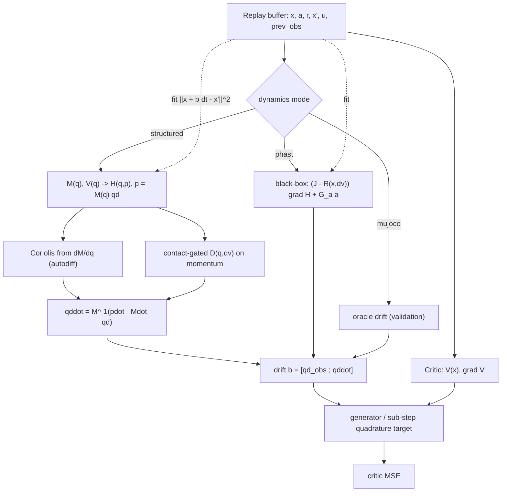

# Structured Port-Hamiltonian Dynamics for Model-Based CT-SAC

:::info
**Overview.** This document is the overarching view of a line of work that improved the *learned dynamics model* behind CT-SAC's model-based critic target. It records the diagnosis (the estimator is not the limiter; the drift model's accuracy is, and on cheetah that accuracy ceiling is the Coriolis structure rather than contacts), the two levers built in response — a **contact-aware damping** term and a **structured port-Hamiltonian model** with a mass-matrix canonicalizer — and the verification (unit tests plus an adversarial review). The detailed generator/variance mechanics live in `docs/ct_sac_model_based_call_stack.md`; the sub-step quadrature target in `docs/ct_sac_substep_quadrature.md`. This doc ties them together and describes the code that landed.
:::

[TOC]

---

## 1. Where the model sits

The model-based critic target evaluates the continuous-time generator analytically from a drift $b(x,a)$ (paper Eq. 6):

$$
(\mathcal{L}^a V)(x) = b(x,a)\cdot\nabla V(x) + \tfrac12\mathrm{Tr}\!\big(\sigma\sigma^\top\nabla^2V\big),\qquad
\text{target} = r + V(x) + \big((\mathcal{L}^a V)(x) - \beta V(x)\big).
$$

The drift $b$ is supplied by `models/port_hamiltonian.py`, either from the MuJoCo oracle (`mode="mujoco"`, exact, validation only) or from a learned model. The learned model shipped as a loose **UNKNOWN-regime** port-Hamiltonian: a black-box energy MLP $H(x)$, a generic learned skew $J = A - A^\top$, and a constant dissipation $R$, with $b = (J-R)\nabla H + G_a a$. On cheetah this fits the drift only weakly (acceleration-block correlation $\approx 0.4\text{–}0.5$), which caps the whole model-based approach.

---

## 2. Diagnosis: the model is the bottleneck, and the bottleneck is Coriolis

Three measurements, in order, located the problem.

**The estimator is not the limiter.** Replacing the autograd term $(b\cdot\nabla V)\,\Delta t$ with a finite difference of a clean value over the model-predicted endpoint, $V(x + b\,\Delta t) - V(x)$, raises the correlation with the true $\Delta V$ from $\approx 0.5$ to $\approx 1.0$ at the physics floor and $\approx 0.9$ at the benchmark step — its only residual is the displacement mismatch $\lVert b\,\Delta t - \Delta x\rVert$ (`docs/ct_sac_model_based_call_stack.md` §6, FD-forward column). So the value-side machinery is adequate; what remains is how well $b$ matches reality.

**On cheetah that residual is Coriolis, not contacts.** The hard-to-fit accelerations $\ddot q = M^{-1}(\tau - c(q,\dot q) - g)$ are dominated by the centrifugal/Coriolis term $c \propto \dot q^2$, driven by the high velocities the run policy seeks. Two checks confirm contacts are not the driver: weakening the exploration (scaled or smoothed actions) drops $\lVert\ddot q\rVert$ by $13\times$ yet leaves the acceleration-fit correlation flat at $\approx 0.45$; and impact-like transitions (large velocity jump) fit no worse than smooth ones.

**A black box cannot cheaply represent Coriolis.** The term is $\tfrac{\partial}{\partial q}\big(\tfrac12\dot q^\top M(q)\dot q\big)$ — it is generated by differentiating the kinetic energy. Forcing a dense MLP gradient through a generic skew matrix to reconstruct that $\dot q^2$-structure is the hardest possible parameterization of the term that dominates the drift.

:::success
**Conclusion of the diagnosis.** Give the model the mechanical structure it was discarding. The two levers below follow directly: contacts are dissipative events (a damping term), and Coriolis is a consequence of a structured mass matrix (a structured energy).
:::

---

## 3. Lever 1 — contact-aware damping (no simulator reads)

PHAST's dissipation is $R = d_0 I + \sum_i \beta_i k_i k_i^\top$ with $\beta_i \ge 0$. **Contact-awareness makes the $\beta_i$ state-dependent, gated by the incoming velocity jump** $\mathrm{d}v = v_t - v_{t-1}$ — a contact shows up as a jump. This reads nothing from MuJoCo and does not leak the label (it uses $t{-}1,t$ to predict the drift at $t$):

$$
\beta(x,\mathrm{d}v) = \mathrm{softplus}\big(\text{net}([x,\mathrm{d}v])\big) \ge 0,\qquad
R(x,\mathrm{d}v) = d_0 I + L\,\mathrm{diag}(\beta)\,L^\top \succeq 0 .
$$

The previous observation is reconstructed inside the replay buffer (`ReplayBatch.prev_observations`, from the preceding slot, zeroed across episode resets), so no algorithm or collection change is needed.

| exploration | baseline accel corr | contact-aware |
|---|---|---|
| white-noise (mean $\lvert\mathrm{d}v\rvert$ 5.2) | 0.51 | 0.50 (parity) |
| OU-smooth (mean $\lvert\mathrm{d}v\rvert$ 2.1) | 0.46 | **0.67** |

The gain appears only when the motion is smooth enough for a contact to stand out as a jump — which is the on-policy regime, since a learning policy produces smooth control. Under white-noise exploration everything jumps and the signal is uninformative. An ablation shows the lift comes from the $\mathrm{d}v$ signal itself (feeding it to the energy helps as much as routing it through $R$); routing it through $R$ is the port-Hamiltonian-faithful choice because it keeps the dissipation PSD and the passivity certificate intact.

---

## 4. Lever 2 — the structured port-Hamiltonian model

This is the decisive change: move from the UNKNOWN black box to a model that learns only the energy's ingredients and lets the physics generate the rest.

### 4.1 What is learned

A symmetric positive-definite mass matrix and a scalar potential, both functions of the configuration:

$$
M(q) = L(q)L(q)^\top + \varepsilon I \ \ (\text{Cholesky, positive diagonal}),\qquad V(q).
$$

These define the Hamiltonian via the **canonicalizer** $p = M(q)\dot q$:

$$
H(q,p) = V(q) + \tfrac12\, p^\top M(q)^{-1} p .
$$

The Coriolis terms are then generated by autodiff of the kinetic energy ($\partial M/\partial q$ via forward-mode Jacobian), not learned by a separate head.

### 4.2 The drift, and passivity

The port-Hamiltonian flow with dissipation on momentum is

$$
\dot q = \frac{\partial H}{\partial p} = M^{-1}p,\qquad
\dot p = -\frac{\partial H}{\partial q} - D(q,\mathrm{d}v)\,\dot q + G_a a,\qquad
\frac{\partial H}{\partial q} = \nabla V - \tfrac12\,\dot q^\top\!\frac{\partial M}{\partial q}\dot q .
$$

Because $R$ acts on momentum with $D \succeq 0$, the model is passive by construction: $\dot H = -\dot q^\top D\,\dot q \le 0$. The damping $D(q,\mathrm{d}v)$ is the contact-gated PSD form from §3, now living where dissipation belongs. The observation-space drift returned to CT-SAC is $[\,\dot q_{\text{obs}} ;\, \ddot q\,]$ with $\ddot q = M^{-1}(\dot p - \dot M\dot q)$.

:::info
**Canonicalizer versus Lagrangian.** The one-step drift here is algebraically identical to the Lagrangian $\ddot q = M^{-1}(G_a a - D\dot q - c - \nabla V)$ — the canonicalizer does not change the fit (measured: acceleration correlation $0.913$ either way). Its value is the passive port-Hamiltonian structure: the certificate $\dot H \le 0$, a natural home for a structure-preserving (Strang) integrator, and the frame for the later diffusion milestone $\sigma\sigma^\top = 2T\,D$.
:::

### 4.3 Coordinate mismatch (cyclic coordinates)

The cheetah observation is $[\,q_{\text{pos}}\,(8);\ \dot q\,(9)\,]$ — eight positions but nine velocities, because the root $x$ is dropped for translation invariance. $x$ is a **cyclic** coordinate: neither $M$ nor $V$ depends on it, so its configuration-gradient slot in $\partial M/\partial q$ and $\partial V/\partial q$ is held at zero, while all nine velocities enter $\dot q$. A `DOFLayout` dataclass carries this mapping so the model is not cheetah-hardcoded; it declares the position/velocity slices, the cyclic config DOFs, the observed-position-to-config map, and (optionally) a sparse actuator map. The position-drift block is then exactly a slice of the observed velocities.

### 4.4 Fitting without a moving target

The model is fit by one-step prediction **in observation space**, $\lVert x + b\,\Delta t - x'\rVert^2$; the canonicalizer stays internal to the forward pass and no momentum-space target is ever formed. This is what avoids the moving-target pathology (a momentum label $\dot p_{\text{obs}} = M_\theta \ddot q + \dot M_\theta \dot q$ would depend on the parameters being trained and can drive $M$ to collapse). The mass matrix is instead identified through how well it predicts the observed trajectory.

### 4.5 Results

| system regime | black-box UNKNOWN | structured |
|---|---|---|
| accel-block corr (white) | 0.49 | **0.91** |
| accel-block corr (OU) | 0.47 | **0.84** |
| multistep rollout rel-err, $H=8$ | 1.37 (collapse) | **0.46** (flat) |

The structured model nearly doubles the one-step fit and, crucially, keeps the multi-step rollout **bounded** where the black box diverges off the data manifold — which is what makes a learned model usable for multi-step prediction on cheetah. It closes most of the gap to the oracle ($\approx 1.0$ accel corr, $\approx 0.35$ flat rollout) while remaining simulator-free.

---

## 5. Implementation and call stack

The port is additive: existing `mujoco` and `phast` modes are byte-unchanged, and CT-SAC / the replay buffer required no edits — the `drift(obs, action, prev_obs=…)` / `fit_step(…, prev_obs=…)` contract and `prev_observations` already existed from the contact-aware work.

| file | change |
|---|---|
| `models/port_hamiltonian.py` | `DOFLayout` dataclass; `mode="structured"` (`_init_structured`, `_mass`, `_potential`, `_damping`, `_structured_drift`); contact-gated $R$ on the existing `contact_aware` flag for `phast`. |
| `common/buffers.py` | `ReplayBatch.prev_observations`, reconstructed from the preceding buffer slot (zeroed across resets / the ring seam). |
| `algorithms/ct_sac.py` | threads `batch.prev_observations` into `fit_step`, `_model_based_target`, and the quadrature roll. |
| `benchmarks/run_ct_rl.py` | `dynamics_source` values `structured` and the `phast` contact flag. |
| `benchmarks/hyperparams/ct_sac.csv` | modes `mbq_phast_contact`, `mbq_structured`, `mbq_structured_contact`. |

---

## 6. Verification

- **Unit tests** (`tests/test_model_based_generator.py`): `DOFLayout` validation; SPD mass; contact-gate uses `prev_obs`; PSD damping (exercised at a scale where the contact term dominates); runs under `no_grad`; `fit_step` reduces loss; custom (non-cheetah) layout; and an end-to-end CT-SAC run. The mode is guarded by an **energy-balance test**: with zero action, $\dot E = -\dot q^\top D\dot q$ exactly, which fails under any Coriolis or $\dot p$ sign error (verified load-bearing: a flipped Coriolis sign gives error $0.06$ against a $10^{-2}$ threshold, versus $3\times10^{-8}$ for the correct code).
- **Adversarial review** (a fan-out of reviewers per dimension, each finding independently refuted before it survived): confirmed six findings, all in the *generalization* path — the cheetah math was confirmed correct. Fixed: strengthened `DOFLayout` validation (partition + coverage, not just a scalar sum), corrected the sparse actuator map (input dimension and additive `index_add` scatter), and closed the two test gaps above.

---

## 7. Scope and open work

- **End-to-end on cheetah.** The results above are offline (one-step fit and rollout). The end-to-end test is a seeded comparison `mbq_phast` vs `mbq_structured` vs `mbq_structured_contact` on `cheetah-run`.
- **Structure-preserving integration.** The CT-SAC multi-step roll currently uses observation-space Euler of the drift, which is bounded and adequate at short horizons; a Strang integrator in $(q,p)$ is the refinement for longer horizons and is enabled by the canonicalizer frame.
- **Diffusion milestone.** $\sigma\sigma^\top = 2T\,D(q)$ is defined in this momentum frame and reuses the learned $D$; deferred.
- **Other domains.** `DOFLayout` makes the model domain-agnostic, but the runner currently constructs the cheetah layout only; another environment needs its own layout passed in.

---

## Appendix — symbol and mode reference

| Symbol / mode | Meaning |
|---|---|
| $M(q)$ | learned SPD mass matrix (Cholesky factor) |
| $V(q)$ | learned scalar potential |
| $p = M(q)\dot q$ | canonicalizer (momentum) |
| $D(q,\mathrm{d}v)$ | contact-gated PSD damping on momentum |
| $G_a$ | actuator port (action to generalized force) |
| `phast` | black-box learned port-Hamiltonian (UNKNOWN regime) |
| `phast` + `contact_aware` | black-box with contact-gated $R$ |
| `structured` | DeLaN-core port-Hamiltonian (this doc) |
| `mbq_structured` / `mbq_structured_contact` | cheetah run modes for the structured model |
