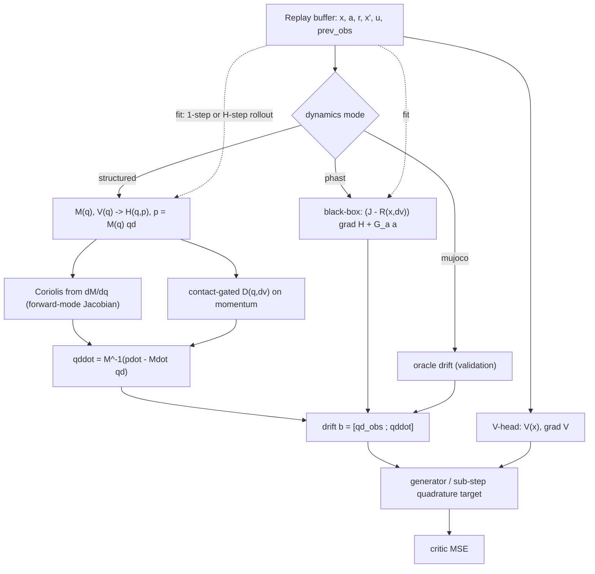

# Structured Port-Hamiltonian Dynamics for Model-Based CT-SAC

:::info
**Overview.** Model-based CT-SAC forms its critic target from a learned dynamics drift $b(x,a)$ evaluated against a value function. This document derives, from that target, the objects the model must supply — a value $V$, its gradient $\nabla V$, and the drift $b$ — and the structured port-Hamiltonian model built to supply $b$: a learned SPD mass matrix $M(q)$, a scalar potential $V(q)$, a contact-gated PSD damping $D$, and an actuator port $G_a$, from which the physics generates the Coriolis term. It then covers how these are trained and coupled, how it relates to the original model-free CT-SAC, and the code that landed; an appendix records why the design works, with the one-step and rollout numbers.
:::

[TOC]

---

## 1. Context

CT-SAC learns a critic whose target is the instantaneous advantage rate

$$
q_V(x,a) = r + (\mathcal{L}^a V)(x) - \beta V(x),
$$

where $\mathcal{L}^a$ is the controlled generator (paper Eq. 6). Model-based CT-SAC evaluates the generator analytically from a dynamics drift $b(x,a)$:

$$
(\mathcal{L}^a V)(x) = b(x,a)\cdot\nabla V(x) + \tfrac12\,\mathrm{Tr}\!\big(\sigma\sigma^\top\nabla^2 V\big).
$$

The drift $b(x,a)$ is the object a dynamics model has to provide. The diffusion $\sigma$ is zero in the current setting (`human_input_intensity = 0`), so the target reduces to the first term. Everything below concerns where $b$ comes from and how it is learned. This section fixes the setting; the diagnosis of why a particular model is needed is in Appendix A.

---

## 2. Where the models arise

### 2.1 What the target asks for

Read off the pieces the target needs. It combines a reward $r$ with the generator, and the generator is $b\cdot\nabla V$. So a model-based critic target requires three things at each state:

- a value $V(x)$,
- its gradient $\nabla V(x)$,
- the dynamics drift $b(x,a)$.

The value and its gradient come from a dedicated scalar **value head** $V_\psi(x)$ (§3). The rest of this section builds the model that supplies $b$, and the objects that must be learned fall out of the construction in order: the mass matrix $M(q)$ and potential $V(q)$ from the energy (§2.2), the damping $D$ and actuator port $G_a$ from the flow (§2.3), and the Coriolis force generated from $M$ (§2.4).

### 2.2 A structured energy that supplies the drift

The drift on a mechanical system is generated by an energy. Split the state into a configuration $q$ and its velocity $\dot q$, and learn two objects of the configuration:

$$
M(q) = L(q)L(q)^\top + \varepsilon I \quad(\text{SPD mass matrix}),\qquad V(q)\quad(\text{scalar potential}).
$$

$M(q)$ is a full lower-triangular Cholesky factor $L(q)$ with a softplus-positive diagonal, plus $\varepsilon I$ for conditioning; it is SPD by construction, and every off-diagonal coupling is representable. These define the Hamiltonian through the **canonicalizer** $p = M(q)\dot q$, which turns velocity into momentum:

$$
H(q,p) = V(q) + \tfrac12\, p^\top M(q)^{-1} p .
$$

The inverse $M^{-1}p$ is a dense linear solve (`torch.linalg.solve`). Appendix C details why this construction is symmetric positive-definite.

### 2.3 The flow, and passivity

The port-Hamiltonian flow with dissipation on momentum and an actuation port is

$$
\dot x = (J - R)\,\nabla H + G_a\,a .
$$

Written out in $(q,p)$, with the damping $R$ realized as $D$ acting on momentum:

$$
\dot q = \frac{\partial H}{\partial p} = M^{-1}p,\qquad
\dot p = -\frac{\partial H}{\partial q} - D(q,\mathrm{d}v)\,\dot q + G_a\,a .
$$

Two learned objects enter here beyond $M$ and $V$: the **damping** $D$ and the **actuator port** $G_a$ (action to generalized force). The damping is diagonal-plus-low-rank PSD,

$$
D = \mathrm{diag}\big(\mathrm{softplus}(\log d)\big) + K\,\mathrm{diag}\big(\mathrm{softplus}(w([q,\mathrm{d}v]))\big)\,K^\top \succeq 0,
$$

with learned low-rank direction columns $K$ and nonnegative gate weights $w \ge 0$ (distinct from the discount rate $\beta$) driven by the incoming velocity jump $\mathrm{d}v = \dot q_t - \dot q_{t-1}$; the base diagonal is always present and the contact term vanishes as $w\to 0$. Because $D$ acts on momentum and is PSD, the model is passive: $\dot H = -\dot q^\top D\,\dot q \le 0$. The port $G_a$ maps the action to a generalized force — a dense linear map to the config axis by default, or a sparse actuator-to-DOF scatter when a `DOFLayout` supplies one. Appendix C details softplus, the gate $w$, and why $D$ is positive-semidefinite.

### 2.4 Coriolis emerges from the mass matrix

The configuration gradient of the Hamiltonian carries a term from the velocity-dependent kinetic energy:

$$
\frac{\partial H}{\partial q} = \nabla V - \tfrac12\,\dot q^\top\!\frac{\partial M}{\partial q}\,\dot q .
$$

The second term is the centrifugal/Coriolis force, a $\dot q^2$-quadratic whose coefficient is the configuration-gradient of the mass matrix. The model generates it by differentiating $M(q)$ with a forward-mode Jacobian ($\partial M/\partial q$ via `jacfwd`); the structure itself supplies the term. This is the payoff of learning the mass matrix.

### 2.5 The drift returned to CT-SAC

The observation is $x=[q_{\text{obs}};\,\dot q]$, so the drift CT-SAC receives is the observation-space rate $[\dot q_{\text{obs}};\,\ddot q]$. The acceleration comes from the momentum equation and the canonicalizer, $\dot p = M\ddot q + \dot M\dot q$, giving

$$
\ddot q = M^{-1}\big(\dot p - \dot M\,\dot q\big),\qquad \dot M = \sum_k \frac{\partial M}{\partial q_k}\,\dot q_k .
$$

The mass rate $\dot M$ reuses the same Jacobian $\partial M/\partial q$ as the Coriolis term, and $\ddot q$ is a dense solve against $M$. The position block $\dot q_{\text{obs}}$ is a slice of the observed velocities.

### 2.6 Cyclic root-x

The cheetah observation is $[q_{\text{pos}}\,(8);\ \dot q\,(9)]$: eight positions but nine velocities, because the root $x$ is dropped for translation invariance while its velocity is kept. That makes $x$ a **cyclic** coordinate: both $M$ and $V$ are independent of it. So its configuration-gradient slot in $\partial M/\partial q$ and $\partial V/\partial q$ is held at zero, while all nine velocities still enter $\dot q$. Concretely, the eight observed position-gradients are scattered into the nine-wide config axis by the observed-position-to-config map (config DOFs $1..8$); the cyclic index (config DOF 0) is absent from that map, so its slot stays zero. A `DOFLayout` dataclass carries this mapping — the position and velocity slices, the cyclic config DOFs, the observed-position-to-config map, and an optional sparse actuator map — so the model applies to other manipulators through a supplied layout. The position-drift block is then exactly the slice of observed velocities that correspond to observed positions.

---

## 3. How the models are trained

Four things learn on every gradient step: the dynamics model, the value head, the twin-$Q$ critic, and the policy. Each is fit by its own regression toward a target that is detached within the step and read from a Polyak-lagged copy of another component. The couplings run in one direction.

**Input:** a replay minibatch of transitions $(x, a, r, x', d, x_{\text{prev}}, \Delta t)$ — observation, action, reward, next observation, done flag, previous observation (supplying the velocity jump $\mathrm{d}v = \dot q - \dot q_{\text{prev}}$), and transition duration — together with the current parameters (dynamics model $\phi$, value head $\psi$, twin-$Q$ critics $\theta$, policy, temperature $\alpha$) and their Polyak-lagged targets $V^{\text{tgt}}, Q^{\text{tgt}}$. With a fit horizon $H>1$ the dynamics step draws its own minibatch of length-$H$ replay windows (consecutive transitions of one episode, with a validity mask); the other updates keep the transition minibatch. All update targets are detached. The step runs these updates in order, with $b_\phi$ the structured drift:

1. **Temperature** $\alpha$ — a gradient step on the entropy-temperature objective.
2. **Dynamics model** $\phi$ ($M$, $V$, $D$, $G_a$) — one-step prediction in observation space, $\displaystyle\min_\phi \big\lVert x + b_\phi(x,a;\,x_{\text{prev}})\,\Delta t - x' \big\rVert^2$; with `dynamics_fit_horizon` $H>1$, the same regression applied at every step of an $H$-step Euler roll of the model over a replay window (§B.2).
3. **Value head** $\psi$ — regress to the soft state value, $\displaystyle\min_\psi \Big\lVert V_\psi(x) - \mathbb{E}_{a'\sim\pi}\big[\min_i Q^{\text{tgt}}_i(x,a') - \alpha\log\pi(a'\mid x)\big] \Big\rVert^2$ (label detached).
4. **Twin-$Q$ critic** $\theta$ — regress to the generator target, $\displaystyle\min_\theta \sum_i \lVert Q_i(x,a) - y \rVert^2$, with
$$
y = r + V^{\text{tgt}}(x) + \big(\Delta t_{\text{default}}\, b_\phi(x,a)\cdot\nabla V^{\text{tgt}}(x) - \beta\,V^{\text{tgt}}(x)\big).
$$
   The sub-step quadrature form replaces the drift term with $V^{\text{tgt}}(\hat x) - V^{\text{tgt}}(x)$ at the rolled endpoint $\hat x$; during warmup, $y$ is the model-free finite difference over the sampled $x'$.
5. **Policy** — a gradient step maximizing $\min_i Q_i(x,a_\pi) - \alpha\log\pi$.
6. **Targets** — Polyak update, $V^{\text{tgt}}, Q^{\text{tgt}} \leftarrow (1-\tau)\,(\text{target}) + \tau\,(\text{live})$.

The objective for each step — the entropy temperature, the observation-space dynamics fit, the soft-value regression, the generator target and its sub-step quadrature form, the policy, and the Polyak target update — is derived in Appendix B.

**Warmup fallback.** The couplings start in a fallback state and hand over as each component warms up. While the dynamics model is still fitting (`dynamics_warmup`), the critic target uses the model-free finite difference over the sampled next state. While the value head is still fitting (`value_warmup`), the generator reads the value from the sampled soft expectation. Once both are warm, the critic target uses the structured drift and the clean value head. A non-trainable oracle drift skips dynamics warmup and is used from the first step.

---

## 4. Relation to the original CT-SAC

Original CT-SAC is model-free: it estimates the generator by a finite difference over a *sampled* successor state, and reads the value on the fly as an action expectation of the twin-$Q$. This work changes how the critic *target* obtains the generator and adds a value head. The actor update, the twin-$Q$ critics with their Polyak targets, the entropy temperature $\alpha$, the rescaled-time discount, and the off-policy replay loop are unchanged, and the original target is retained as the fallback (during model/head warmup, or whenever `use_model_based_q` is off).

| aspect | original CT-SAC (model-free) | this (model-based, structured) |
|---|---|---|
| generator $\mathcal{L}^a V - \beta V$ | finite difference over the sampled next state $x'$: $\big(\gamma^{u}V(x') - V(x)\big)/u$ (paper Eq. 166) | analytic $b\cdot\nabla V$ from the learned drift, or a sub-step quadrature $V(\hat x) - V(x)$ over the model-rolled endpoint $\hat x$ — no $x'$ |
| value $V(x)$ | recomputed each use as the sampled $\mathbb{E}_a[\min_i Q^{\text{tgt}}_i - \alpha\log\pi]$ | dedicated scalar V-head ($Q = V + q$), regressed to that soft value; clean, sample-free $V$ and $\nabla V$ |
| dynamics | none | learned structured port-Hamiltonian $b(x,a)$, fit online in observation space |
| critic step | one twin-$Q$ update | V-head and twin-$Q$ both updated each step, with acyclic detached targets from Polyak-lagged copies |
| target variance as $u \to 0$ | $\mathcal{O}(1/u)$ — divides a noisy value difference by $u$ | $u$-independent — no $1/u$ differencing |

The two generator estimates are the same object. By Dynkin's formula the finite difference $\big(\gamma^{u}V(x') - V(x)\big)/u \to \mathcal{L}^a V - \beta V$ as $u\to 0$, which is exactly what $b\cdot\nabla V - \beta V$ evaluates directly once $b$ is known. So this is a drop-in replacement for how the target is formed, not a change to the RL objective. The value head is the original SAC (Haarnoja 2018) structure — a state-value network regressed to $\mathbb{E}_a[Q - \alpha\log\pi]$ with a Polyak target — reintroduced because the generator needs a differentiable, low-noise $V(x)$ and $\nabla V(x)$; SAC's later revision dropped that network in favour of the sampled min-$Q$ form, which is the path the model-free target still takes.

One consequence to keep in view: the analytic generator lowers the per-update *target* variance at small $u$, but the value iteration's *outcome* is governed by contraction — the model-free backup is a $\gamma$-contraction, while the $b\cdot\nabla V$ backup is a differential operator that is not sup-norm contractive. A more accurate model improves target quality; the contraction property is a separate matter. This is why the end-to-end comparison keeps the model-free baseline and the oracle alongside the learned-model variants.

---

## 5. Implementation and call stack

The port is additive: the existing `mujoco` and `phast` modes are byte-unchanged, and CT-SAC and the replay buffer carry over as-is — the `drift(obs, action, prev_obs=…)` / `fit_step(…, prev_obs=…)` contract and `prev_observations` already existed from the contact-aware work.

| file | change |
|---|---|
| `models/port_hamiltonian.py` | `DOFLayout` dataclass; `mode="structured"` (`_init_structured`, `_mass`, `_potential`, `_damping`, `_structured_drift`); contact-gated $R$ on the existing `contact_aware` flag for `phast`; `fit_step_rollout` ($H$-step masked BPTT fit, §B.2). |
| `common/buffers.py` | `ReplayBatch.prev_observations`, reconstructed from the preceding buffer slot (zeroed across resets and the ring seam); `ReplaySequenceBatch` + `sample_sequences` (length-$H$ windows with a cumulative validity mask that breaks at episode ends and the ring seam). |
| `algorithms/ct_sac.py` | threads `batch.prev_observations` into `fit_step`, `_model_based_target`, and the quadrature roll; `dynamics_fit_horizon` routes the dynamics update through `sample_sequences` + `fit_step_rollout`. |
| `benchmarks/run_ct_rl.py` | `dynamics_source` value `structured` and the `phast` contact flag. |
| `benchmarks/hyperparams/ct_sac.csv` | modes `mbq_phast_contact`, `mbq_phast_vhead`, `mbq_structured`, `mbq_structured_contact`, `mbq_structured_quad`, `mbq_structured_quad_contact` (the structured modes carry the V-head so the target is not gradient-limited); rollout-fit variants `mbq_structured_roll`, `mbq_structured_quad_roll`, `mbq_structured_quad_contact_roll` (fit horizon 4). |

---

## 6. Scope and open work

- **Dense Cholesky and Woodbury.** $M(q)$ is a full lower-triangular Cholesky factor $M = L(q)L(q)^\top + \varepsilon I$ and $M^{-1}p$ is a dense `torch.linalg.solve`. At cheetah's $n_v = 9$ this dense factorization is negligible in cost and more expressive. The diagonal-plus-low-rank + Woodbury parameterization of the mass matrix (PHAST's form) is the alternative worth adopting when scaling to high-DOF systems where $n_v$ is large.
- **End-to-end on cheetah.** The reported results are offline (one-step fit and rollout; Appendix A). The end-to-end test is a seeded comparison against the model-free baseline (`top`) and the oracle ceiling (`mbq_vhead`), with the model-based modes on a clean V-head: `mbq_phast_vhead` (head-matched black box), `mbq_structured` (first-order), `mbq_structured_quad` (sub-step quadrature), `mbq_structured_contact` (contact-gated), and `mbq_structured_quad_contact` (both), plus the rollout-fit variants `mbq_structured_roll`, `mbq_structured_quad_roll`, and `mbq_structured_quad_contact_roll` (`dynamics_fit_horizon` 4).
- **Structure-preserving integration.** The multi-step roll uses observation-space Euler of the drift, which is bounded and adequate at short horizons; a Strang integrator in $(q,p)$ is the refinement for longer horizons, enabled by the canonicalizer frame.
- **Diffusion milestone.** $\sigma\sigma^\top = 2T\,D(q)$ is defined in the momentum frame and reuses the learned $D$; deferred.
- **Other domains.** `DOFLayout` makes the model domain-agnostic, but the runner currently constructs the cheetah layout only; another environment needs its own layout passed in.

---

## Appendix A — Why this design works

### Diagnosis

The drift's accuracy sets the ceiling on the target. With a clean value, the value change over the model-predicted endpoint, $V(x + b\,\Delta t) - V(x)$, correlates with the true $\Delta V$ at $\approx 1.0$ at the physics floor and $\approx 0.9$ at the benchmark step; the only residual is the displacement mismatch $\lVert b\,\Delta t - \Delta x\rVert$. So target quality is governed by how well $b$ matches the true dynamics.

On cheetah the residual is the Coriolis structure. The hard-to-fit accelerations $\ddot q = M^{-1}(\tau - c(q,\dot q) - g)$ are dominated by the centrifugal/Coriolis term $c \propto \dot q^2$, driven by the high velocities the run policy seeks. Contacts were checked and ruled out as the driver: weakening exploration (scaled or smoothed actions) drops $\lVert\ddot q\rVert$ by $13\times$ while the acceleration-fit correlation holds at $\approx 0.45$, and impact-like transitions (large velocity jump) fit as well as smooth ones.

A black-box energy represents that term only at high cost. Coriolis is $\tfrac{\partial}{\partial q}\big(\tfrac12\dot q^\top M(q)\dot q\big)$ — it is produced by differentiating the kinetic energy. A dense MLP gradient pushed through a generic skew matrix has to reconstruct that $\dot q^2$-structure by brute force, the hardest parameterization of the term that dominates the drift. The structured energy in §2 generates Coriolis directly from $\partial M/\partial q$, and the contact-gated damping supplies the dissipation.

The damping earns its place on smooth, on-policy data. Its low-rank weights are gated by the velocity jump $\mathrm{d}v$, and a contact stands out as a jump only when the surrounding motion is smooth — the on-policy regime, since a learning policy produces smooth control. Under white-noise exploration everything jumps and the signal is uninformative.

### Results

**Structured energy.**

| system regime | black-box energy | structured |
|---|---|---|
| accel-block corr (white) | 0.49 | **0.91** |
| accel-block corr (OU) | 0.47 | **0.84** |
| multistep rollout rel-err, $H=8$ | 1.37 (collapse) | **0.46** (flat) |

The structured model nearly doubles the one-step fit and keeps the multi-step rollout bounded where the black box diverges off the data manifold, which is what makes a learned model usable for multi-step prediction on cheetah. It closes most of the gap to the oracle ($\approx 1.0$ accel corr, $\approx 0.35$ flat rollout) while staying simulator-free.

**Contact-aware damping.**

| exploration | baseline accel corr | contact-aware |
|---|---|---|
| white-noise (mean $\lvert\mathrm{d}v\rvert$ 5.2) | 0.51 | 0.50 (parity) |
| OU-smooth (mean $\lvert\mathrm{d}v\rvert$ 2.1) | 0.46 | **0.67** |

The gain shows up under smooth exploration, matching the diagnosis: the $\mathrm{d}v$ gate is informative precisely when contacts are distinguishable from the surrounding motion.

**Multi-step rollout fit.** Offline, matched update counts and batch size, structured + contact model on OU-smooth cheetah data (4k transitions, held-out tail; open-loop error displacement-normalized, so numbers are not comparable across tables). At 8k updates:

| held-out metric | one-step fit | rollout fit $H=2$ | rollout fit $H=4$ |
|---|---|---|---|
| accel-block corr | 0.47 | 0.55 | **0.57** |
| open-loop rel-err, $H=4$ | 1.07 | 0.96 | **0.89** |
| open-loop rel-err, $H=8$ | 0.83 | 0.83 | **0.77** |

The ordering is monotone in the fit horizon on every metric. The trajectory matters as much as the endpoint: at 2.5k updates the one-step fit is still ahead (accel corr 0.58 vs 0.51 — backprop through the roll optimizes more slowly per update), and between 2.5k and 8k the one-step fit's held-out metrics *degrade* (accel corr 0.58 → 0.47, $H{=}4$ rel-err 0.84 → 1.07) while the rollout fit's improve throughout. Continued one-step training buys train-set residual at the cost of the model-predicted states the quadrature target reads. Benchmark runs take $\sim10^6$ updates, so the long-run regime is the operative one, and it favors the rollout fit.

---

## Appendix B — Math behind the training steps

This appendix derives the objective behind each of the six numbered updates in §3. The step trains four learners — the dynamics model $\phi$ (drift $b_\phi$), the value head $V_\psi$, the twin-$Q$ critic $\theta$, and the policy $\pi$ — plus the temperature $\alpha$. Each is a regression toward a label that is detached within the step, and the dependencies run one way: replay data feeds the dynamics model; the lagged twin-$Q$ $Q^{\text{tgt}}$ feeds the value head; the lagged value head $V^{\text{tgt}}$ and the drift $b_\phi$ feed the twin-$Q$; the live twin-$Q$ feeds the policy. Each label is a detached read of another learner's Polyak-lagged copy, so every component takes a plain supervised step, and the lagged targets are what keep the four mutually consistent.

Throughout, $x=[q_{\text{obs}};\dot q]$ is the observation, $\beta=-\log\gamma$ is the discount rate, and $\Delta t_{\text{default}}$ is the nominal control step (`env.dt_default`). The rescaled time $u=\Delta t/\Delta t_{\text{default}}$ measures a transition's duration in units of that step, so a nominal transition has $u\approx 1$ and $\beta$ is a per-nominal-step rate. The controlled generator of a value $V\in C^2$ under a fixed action $a$ (paper Eq. 6) is

$$
(\mathcal{L}^a V)(x) = b(x,a)\cdot\nabla V(x) + \tfrac12\,\mathrm{Tr}\!\big(\sigma(x,a)\sigma(x,a)^\top\nabla^2 V(x)\big)
\;\xrightarrow{\;\sigma=0\;}\; b(x,a)\cdot\nabla V(x),
$$

and $\sigma=0$ throughout the current setting.

### B.1 Temperature

The temperature $\alpha$ weights the entropy term $-\alpha\log\pi$ in the soft objective (paper Eq. 40). It is fit to hold the policy at a target entropy $\bar H$ ($\bar H=-|\mathcal A|$ by default) by the standard SAC auto-temperature objective

$$
\min_{\alpha>0}\;\; \mathbb{E}_{a\sim\pi(\cdot\mid x)}\!\big[\,-\alpha\,\big(\log\pi(a\mid x) + \bar H\big)\,\big],
$$

the Lagrangian of $\max_\pi\mathbb{E}[\text{return}]$ subject to $\mathbb{E}[-\log\pi]\ge\bar H$, with $\alpha$ the multiplier. Parameterizing $\alpha=e^{\lambda}$ and differentiating in $\lambda$ gives the gradient $\mathbb{E}_a[-\alpha(\log\pi+\bar H)]$: when the current entropy $-\mathbb{E}_a[\log\pi]$ exceeds $\bar H$ the bracket is negative in expectation and $\alpha$ decreases, and conversely, driving $-\mathbb{E}_a[\log\pi]\to\bar H$. In `train()` a single reparameterized $a,\log\pi(a\mid x)$ is drawn from the current policy, the target-entropy sum is detached, and the step is taken on $\lambda=\log\alpha$ (`alpha_loss = -(log_alpha * (log_prob_pi + target_entropy).detach()).mean()`). The resulting $\alpha=e^\lambda$ is then held fixed (detached) inside every downstream loss in the same step; a fixed $\alpha$ skips this update.

### B.2 Dynamics model fit

The model supplies the observation-space drift $b_\phi(x,a)$ that the generator (§B.4) evaluates. It is fit by one-step prediction: with the explicit Euler predictor over the observed duration $\Delta t$,

$$
\hat x' = x + b_\phi(x,a;\,x_{\text{prev}})\,\Delta t,
\qquad
\mathcal L_{\text{dyn}}(\phi) = \big\lVert\, x + b_\phi(x,a;\,x_{\text{prev}})\,\Delta t \;-\; x' \,\big\rVert^2 ,
$$

matching `fit_step` (`pred = x + drift(x,a)*dt`, `loss = ((pred - x')**2).mean()`). Since $b$ is the instantaneous rate $\dot x$, the target satisfies $x'\approx x+\dot x\,\Delta t$ to first order, and driving the residual to zero fits $b_\phi$ to the realized rate $(x'-x)/\Delta t$. The structured drift assembles $b_\phi$ from the port-Hamiltonian flow (§2.5): with the canonicalizer $p=M(q)\dot q$,

$$
\dot p = -\Big(\nabla V(q) - \tfrac12\,\dot q^\top\tfrac{\partial M}{\partial q}\,\dot q\Big) - D(q,\mathrm dv)\,\dot q + G_a a,
\qquad
b_\phi = [\dot q_{\text{obs}};\ \ddot q],\quad \ddot q = M^{-1}\big(\dot p - \dot M\dot q\big).
$$

The regression is taken entirely in observation space. The canonicalizer $p=M(q)\dot q$ lives inside the forward pass and the loss never constructs a momentum-space label — the only target is the observed $x'$. Two consequences follow. First, the regression target $x'$ is a fixed datum, independent of $\phi$: there is no momentum coordinate that co-adapts with $M$, so the fit cannot lower its loss by rescaling the momentum. Second, $M(q)$ enters the prediction only through the acceleration $\ddot q=M^{-1}(\dot p-\dot M\dot q)$, so it is identified by how well that reproduces the observed accelerations, which keeps the mass matrix anchored to data through the prediction loss alone. (A momentum-space loss $\lVert\hat p'-p'\rVert^2$ would need labels $p'=M(q')\dot q'$ built from the same learned $M$, coupling the target to the parameters.) A non-trainable oracle drift (`mode="mujoco"`) has no parameters and skips this step.

**Multi-step rollout fit** (`dynamics_fit_horizon` $=H>1$). The one-step loss evaluates $b_\phi$ only at buffer states, while the sub-step quadrature target (§B.4) evaluates it along the model's own roll — predicted states the one-step fit never visits, where the error compounds. The rollout fit trains exactly that regime. Sample a window of $H$ consecutive transitions $(x_t, a_t, \dots, x_{t+H})$ of one episode, roll the model open-loop from the window start,

$$
\hat x_t = x_t,\qquad
\hat x_{t+k+1} = \hat x_{t+k} + b_\phi\big(\hat x_{t+k}, a_{t+k};\, \hat x_{t+k-1}\big)\,\Delta t_{t+k},
\qquad k = 0,\dots,H-1,
$$

and regress every rolled state onto its observed counterpart,

$$
\mathcal L_{\text{roll}}(\phi) = \frac{\sum_{k} m_k\,\big\lVert \hat x_{t+k+1} - x_{t+k+1} \big\rVert^2}{\dim(x)\,\sum_k m_k},
$$

with gradients through the whole roll (backprop through time; `fit_step_rollout`). The cumulative mask $m_k\in\{0,1\}$ cuts the window where it crosses an episode end or the replay ring's seam, so no target mixes two episodes; the velocity jump feeding the contact gate uses the real predecessor $x_{t-1}$ at $k=0$ and the rolled states after — the same convention as the quadrature roll. $H=1$ with a full mask recovers the one-step loss exactly. Appendix A's multi-step rollout relative error is the matching evaluation: the rollout fit optimizes that quantity directly instead of only the one-step residual, which is what keeps the model accurate at the model-predicted states the critic target consumes.

**Stability guards.** The compounding steps evaluate the drift at the model's own predictions, where nothing bounds it — the Coriolis term is quadratic in velocity, so at high on-policy speeds one bad prediction can blow up the rest of the roll, overflow the loss, and NaN the parameters through BPTT; the NaN then reaches the critic through the generator target and kills the whole agent (observed in the first `mbq_structured_quad_contact_roll` benchmark run: return pinned at exactly 0 from step 260k with no recovery). Two guards inside the fit close this, both inert in the healthy regime: (i) the $k\ge1$ Euler increments are clamped elementwise to $5\times$ the window's largest observed one-step change (the first step stays unclamped, preserving the $H{=}1$ equivalence; saturated entries also stop back-propagating); (ii) every dynamics fit clips gradients to a global norm of 10 and skips the update — reporting the loss — when the loss or gradient norm is non-finite. Should the model still diverge, `train()` raises on a non-finite model-based target and terminates the run: recovery is impossible once NaN reaches the critic, and a model-free fallback would contaminate the model-based benchmark, so the run is kept a pure model-based result or an explicit failure.

### B.3 Value head

The generator needs a differentiable state value $V(x)$ and gradient $\nabla V(x)$. The soft state value of $\pi$ at temperature $\alpha$ is the entropy-regularized action aggregate of the state–action value,

$$
V^\pi(x) = \mathbb{E}_{a\sim\pi(\cdot\mid x)}\big[\,Q(x,a) - \alpha\log\pi(a\mid x)\,\big],
$$

the soft-value operator $\mathcal Q^{(\alpha)}(q)(x)=\sup_\pi\mathbb E_{a\sim\pi}[q(x,a)-\alpha\log\pi(a\mid x)]$ evaluated at the current policy, whose supremum is attained at the Boltzmann policy $\pi_q$ (paper Eq. 54). With twin critics the min is taken over the two heads for overestimation control, and the target uses the lagged critic $Q^{\text{tgt}}$:

$$
\min_\psi\;\Big\lVert\, V_\psi(x) - \underbrace{\mathbb{E}_{a'\sim\pi}\big[\,\textstyle\min_i Q^{\text{tgt}}_i(x,a') - \alpha\log\pi(a'\mid x)\,\big]}_{\text{detached label}}\,\Big\rVert^2 .
$$

The label is a reparameterized $N$-sample Monte-Carlo estimate: `_value_expectation` repeats each state $N$ times, draws $a'=\pi_\psi(\varepsilon;x)$, evaluates $\min_i Q^{\text{tgt}}_i-\alpha\log\pi$, and averages ($N=$ `num_expectation_samples`). Regressing $V_\psi$ onto this expectation folds the action sampling into the fit: at its point of use in §B.4 the generator reads a scalar $V_\psi(x)$ and its gradient $\nabla V_\psi(x)$ that are deterministic in $x$ and carry no action-sampling noise, and it differentiates neither the twin-min nor the stochastic policy. This critic value head $V_\psi(x)$ is distinct from the model potential $V(q)$ of §2.2.

### B.4 Twin-$Q$ critic / generator target

This is the central update. In continuous time the state–action object that survives the small-step limit is the instantaneous advantage rate. For a value $V\in C^2$, a Markov policy $\pi$, and temperature $\alpha$, the paper defines it (Eq. 164) as

$$
q_V^{(\pi,\alpha)}(x,a) \;=\; r(x,a) - \alpha\log\pi(a\mid x) + (\mathcal L^a V)(x) - \beta V(x),
\tag{paper Eq. 164}
$$

with the entropy $-\alpha\log\pi$ folded in. The critic learns $Q = V + q_V$, so the regression target is $y = r + V(x) + (\mathcal L^a V - \beta V)(x)$; with the entropy already accounted for inside the soft value $V$ of §B.3, the term $r-\alpha\log\pi$ separates from the generator part $\mathcal L^a V - \beta V$.

**Why the generator is the right target (Dynkin).** The generator part is the small-time limit of a discounted value increment. Dynkin's formula for the controlled diffusion (paper Lemma C.4, Eq. 44) gives, under the constant action $a$,

$$
\mathbb{E}\big[V(X_{t+u})\big] = V(x) + \mathbb{E}\!\int_0^{u}(\mathcal L^a V)(X_{t+s})\,\mathrm{d}s .
$$

Differentiating the discounted expectation at $u=0$,

$$
\left.\frac{\mathrm d}{\mathrm d u}\Big[e^{-\beta u}\,\mathbb E\,V(X_{t+u})\Big]\right|_{u=0}
= (\mathcal L^a V)(x) - \beta V(x),
$$

so the short-horizon estimator over a duration $u$ (paper Eq. 166) converges to exactly this rate:

$$
q_u^{(\pi,\alpha)}(x,a) = \frac{e^{-\beta u}V(X_{t+u}) - V(x)}{u} + r(x,a) - \alpha\log\pi(a\mid x)
\;\xrightarrow[u\to0]{}\; q_V^{(\pi,\alpha)}(x,a).
\tag{paper Eq. 166}
$$

**Model-free fallback.** The model-free target instantiates Eq. 166 directly on the sampled successor $x'$ over the rescaled duration $u=\Delta t/\Delta t_{\text{default}}$, reading $V$ as the soft value of §B.3:

$$
y_{\text{fd}} = r + (1-d)\Big[\,V(x) + \tfrac{\gamma^{u}\,V(x') - V(x)}{u}\,\Big],
\qquad \gamma^{u}=e^{-\beta u},
$$

which is `_finite_difference_target` (`gamma_dt = exp(-beta*dt)`, `fraction = (gamma_dt*V_next - V_cur)/dt`). Dividing a noisy value difference by $u$ makes this estimator $\mathcal O(1/u)$ in variance as $u\to0$. It is used during dynamics/head warmup and whenever `use_model_based_q` is off.

**Model-based (first-order) target.** Once the drift is available, the generator is evaluated analytically as $b_\phi\cdot\nabla V^{\text{tgt}}$ (with $\sigma=0$), so no sampled $x'$ enters. To match the finite-difference convention — the increment measured over one nominal step of rescaled duration $u=1$ — the rate $\mathcal L^a V$ enters scaled by $\Delta t_{\text{default}}$ while the discount stays a single $\beta V$ lump:

$$
\boxed{\;y = r + (1-d)\Big[\,V^{\text{tgt}}(x) + \big(\Delta t_{\text{default}}\; b_\phi(x,a)\cdot\nabla V^{\text{tgt}}(x)\; -\; \beta\,V^{\text{tgt}}(x)\big)\Big]\;}
$$

matching `_model_based_target` (`lf = dt_default * (b·gradV) - beta*V`, `y = r + (1-d)*(V + lf)`, all detached). Here $V^{\text{tgt}}=V_\psi^{\text{tgt}}$ is the lagged value head, $\nabla V^{\text{tgt}}$ is obtained by autograd of $V^{\text{tgt}}(x)$ w.r.t. a leaf copy of $x$ (not w.r.t. the frozen target parameters), and $b_\phi$ is the detached drift of §B.2. The increment is evaluated rather than divided by $u$, so the target is $u$-independent and the $1/u$ variance of the fallback is absent. When $\sigma\neq0$ the dropped trace term $\tfrac12\mathrm{Tr}(\sigma\sigma^\top\nabla^2 V)$ is added back through Hessian–vector products, scaled by the same $\Delta t_{\text{default}}$.

**Sub-step quadrature target.** The first-order term $\Delta t_{\text{default}}\,(b\cdot\nabla V)$ samples the rate at the single point $s=0$; Dynkin's identity is the integral of the rate along the orbit,

$$
V(x') - V(x) = \int_0^{\Delta t_{\text{default}}} (\mathcal L^a V)\big(x(s)\big)\,\mathrm d s .
$$

The quadrature form ($m=$ `generator_substeps`) approximates the integral by rolling the model $m$ explicit Euler sub-steps of size $h=\Delta t_{\text{default}}/m$,

$$
\hat x_0 = x,\qquad \hat x_{k+1} = \hat x_k + b_\phi(\hat x_k,a;\,\hat x_{k-1})\,h,\qquad k=0,\dots,m-1,
$$

with the first velocity jump taken against the real predecessor $x_{\text{prev}}$ and each later one against the previous rolled state (so the contact-gate input $\mathrm dv$ is well defined along the roll), then reads the value change directly off the clean value head at the endpoint:

$$
\ell_f = \big(V^{\text{tgt}}(\hat x_m) - V^{\text{tgt}}(x)\big) - \beta\,V^{\text{tgt}}(x),
\qquad y = r + (1-d)\big(V^{\text{tgt}}(x) + \ell_f\big),
$$

which is `_substep_quadrature_target`. It uses no autograd: the value gradient and its curvature enter through the finite difference of $V^{\text{tgt}}$ over the predicted states, so it captures the curvature the single-point term drops. $m=1$ is a single-Euler-step finite difference over states, $\hat x_1 = x + b_\phi\,\Delta t_{\text{default}}$; larger $m$ shrinks the Euler integration error in $\hat x_m$. The discount is kept as the single $-\beta V^{\text{tgt}}(x)$ lump, matching the first-order target.

**Loss.** Whichever target $y$ is formed is detached, and both twin heads regress to it:

$$
\mathcal L_{\text{crit}}(\theta) = \sum_i \big\lVert Q_i(x,a) - y \big\rVert^2 ,
$$

matching `sum(F.mse_loss(q, y) for q in q_values(obs, actions))`.

### B.5 Policy

The policy maximizes the soft value of §B.3 at the current state — the entropy-regularized aggregate whose supremum defines $\mathcal Q^{(\alpha)}$ (paper Eq. 54) — using the live twin-$Q$:

$$
\max_\pi\;\; \mathbb{E}_{a\sim\pi(\cdot\mid x)}\big[\,\textstyle\min_i Q_i(x,a) - \alpha\log\pi(a\mid x)\,\big].
$$

With the reparameterization $a_\pi=\pi(\varepsilon;x)$, the gradient flows through both $\min_i Q_i$ and $\log\pi$, and minimizing the negative gives the actor loss

$$
\mathcal L_\pi = \mathbb{E}\big[\,\alpha\log\pi(a_\pi\mid x) - \textstyle\min_i Q_i(x,a_\pi)\,\big],
$$

matching `(alpha * log_prob_pi - min_q(obs, actions_pi)).mean()`. The same $a_\pi,\log\pi$ sampled in §B.1 are reused, the critic parameters are frozen during this step so the gradient updates only the policy, and $\alpha$ is the detached temperature of §B.1.

### B.6 Target networks

The value head and the twin-$Q$ critic supply the detached labels of §B.3–B.4 through lagged copies, held by a Polyak (exponential-moving-average) update applied every step at the shared rate $\tau$:

$$
\theta^{\text{tgt}} \leftarrow (1-\tau)\,\theta^{\text{tgt}} + \tau\,\theta,
\qquad
\psi^{\text{tgt}} \leftarrow (1-\tau)\,\psi^{\text{tgt}} + \tau\,\psi,
$$

for the twin-$Q$ targets $Q^{\text{tgt}}$ and the value head $V^{\text{tgt}}$, matching `soft_update_targets(tau=self.tau)` (`target.mul_(1-tau).add_(tau*param)`). A hard periodic copy is the limit $\tau\to1$ at intervals; the soft update trails the live parameters continuously with time constant $\sim1/\tau$, giving a slowly moving, low-variance label. This lag, together with detaching the labels within the step, keeps the four one-directionally coupled updates mutually consistent without any within-step feedback.

---

## Appendix C — Parameterizing the learned matrices

The mass matrix and the damping are learned, yet each must meet a structural constraint — $M$ symmetric positive-definite, $D$ symmetric positive-semidefinite. Both are constructed so the constraint holds for any network output, so training is unconstrained and the matrices are always valid.

### C.1 SPD mass matrix $M(q) = L(q)L(q)^\top + \varepsilon I$

$L(q)$ is the learned object: the network emits its entries and $M$ is assembled from it.

**Symmetric.** For any matrix $L$, the product $LL^\top$ is symmetric, since $(LL^\top)^\top = LL^\top$; adding $\varepsilon I$ keeps it symmetric. So $M = M^\top$ for any $L$.

**Positive-definite.** $LL^\top$ is a Gram matrix, hence positive-semidefinite: $v^\top LL^\top v = \lVert L^\top v\rVert^2 \ge 0$ for every $v$. Adding $\varepsilon I$ with $\varepsilon>0$ makes it strictly positive-definite,

$$
v^\top M v = \lVert L^\top v\rVert^2 + \varepsilon\lVert v\rVert^2 \ge \varepsilon\lVert v\rVert^2 > 0 \qquad (v \ne 0),
$$

so every eigenvalue of $M$ is at least $\varepsilon$. That floor also keeps $M$ invertible and well-conditioned, which the drift needs for the solve $M^{-1}(\cdots)$.

**Cholesky parameterization.** $L(q)$ is not arbitrary: the network emits the $n_v(n_v+1)/2$ lower-triangular entries, and the diagonal is passed through softplus so it is strictly positive. Lower-triangular matrices with a positive diagonal are in bijection with SPD matrices (the Cholesky factorization), so this form represents every mass matrix and only SPD ones — the unconstrained network outputs are mapped onto the SPD cone by the triangular structure and the positive diagonal. The positive diagonal already makes $LL^\top$ strictly positive-definite; the $\varepsilon I$ is an added conditioning margin.

**Why.** A mechanical mass matrix is SPD: the kinetic energy $\tfrac12\dot q^\top M(q)\dot q$ is positive for any nonzero velocity, $M$ is symmetric, and the acceleration $\ddot q = M^{-1}(\cdots)$ needs $M$ invertible. The construction guarantees all three for any parameters, and $M(q)$ varies with configuration as a physical mass matrix does.

### C.2 PSD damping $D(q,\mathrm{d}v) = \mathrm{diag}\big(\mathrm{softplus}(\log d)\big) + K\,\mathrm{diag}\big(\mathrm{softplus}(w)\big)\,K^\top$

**softplus.** $\mathrm{softplus}(z) = \log(1 + e^{z})$ maps any real number to a strictly positive one — for large $z$ it is $\approx z$, for large negative $z$ it is $\approx e^{z}$ (small but positive). It is a smooth version of $\max(0,z)$, so a parameter or a network output can range over all reals while the quantity it feeds stays positive. That is how each damping coefficient is held nonnegative.

**The gate $w$.** $w = \mathrm{softplus}(\text{net}([q,\mathrm{d}v]))$ is a short vector of nonnegative gate weights, one per column of $K$, produced by a small network of the configuration $q$ and the velocity jump $\mathrm{d}v = \dot q_t - \dot q_{t-1}$ (it is separate from the discount rate $\beta$). Because a contact registers as a velocity jump, $w$ raises the extra damping when $\mathrm{d}v$ signals a contact and shrinks toward zero on smooth motion.

**The two terms.** The base $\mathrm{diag}(\mathrm{softplus}(\log d))$ is a learned, state-independent per-DOF damping that is always present. The second term $K\,\mathrm{diag}(w)\,K^\top = \sum_i w_i\,k_i k_i^\top$ adds a low-rank (rank $\le r$), state-dependent contribution in the learned direction columns $k_i$ of $K$, weighted by the gate.

**Positive-semidefinite.** The base diagonal is PSD (nonnegative entries). The low-rank term is PSD by the Gram argument: $v^\top K\,\mathrm{diag}(w)\,K^\top v = \sum_i w_i\,(K^\top v)_i^2 \ge 0$, since each $w_i \ge 0$. A sum of PSD matrices is PSD, so $D \succeq 0$ for any network output.

**Why.** $D$ is the dissipation, and the passivity certificate is $\dot H = -\dot q^\top D\,\dot q \le 0$ (§2.3) — energy only leaves the system, which requires $D \succeq 0$. Damping is naturally a few contact modes and may be zero in some directions, so it uses this diagonal-plus-low-rank PSD form; the mass matrix, which is inverted, uses the full-rank Cholesky form of C.1.

---

## Appendix D — Symbol and mode reference

| Symbol / mode | Meaning |
|---|---|
| $M(q)$ | learned SPD mass matrix, full lower-triangular Cholesky $M = LL^\top + \varepsilon I$; $M^{-1}p$ a dense solve |
| $V(q)$ | learned scalar potential (model energy) |
| $V_\psi(x)$ | critic value head, regressed to $\mathbb{E}_a[\min_i Q^{\text{tgt}}_i - \alpha\log\pi]$ |
| $p = M(q)\dot q$ | canonicalizer (momentum) |
| $D(q,\mathrm{d}v)$ | contact-gated diagonal-plus-low-rank PSD damping on momentum |
| $G_a$ | actuator port (action to generalized force) |
| $\mathrm{d}v$ | incoming velocity jump $\dot q_t - \dot q_{t-1}$, gates the damping |
| `mujoco` | oracle drift from the simulator (validation only) |
| `phast` | black-box learned port-Hamiltonian |
| `phast` + `contact_aware` | black-box with contact-gated $R$ |
| `structured` | structured port-Hamiltonian with $M(q)$, $V(q)$ (this doc) |
| cheetah run modes | `mbq_structured` (V-head, first-order), `mbq_structured_quad` (V-head, sub-step quadrature), `mbq_structured_contact` (contact-gated damping), `mbq_structured_quad_contact` (quadrature + contact gate), `mbq_phast_vhead` (head-matched black box). All read $V,\nabla V$ from the detached V-head. |
| `*_roll` modes | `mbq_structured_roll`, `mbq_structured_quad_roll`, `mbq_structured_quad_contact_roll` — the same modes with the dynamics model fit by the $H$-step rollout regression (§B.2, `dynamics_fit_horizon` 4) instead of the one-step fit. |
