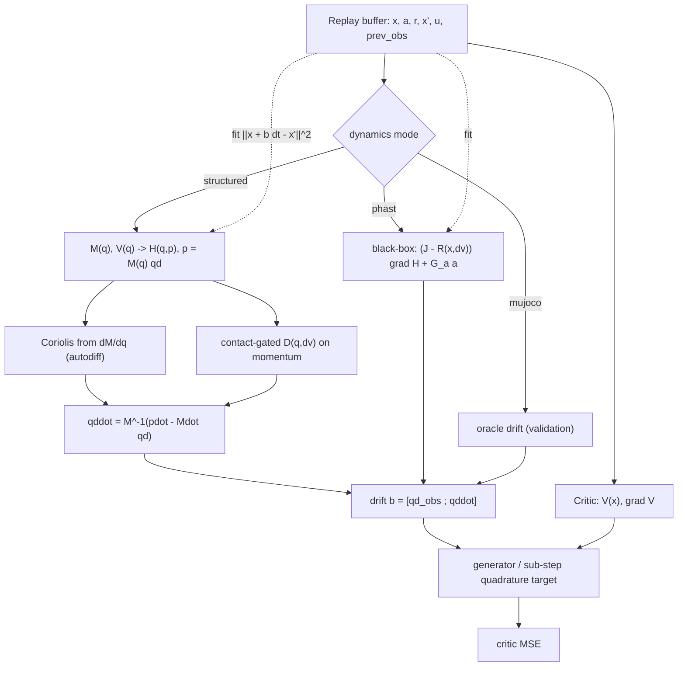

# Structured Port-Hamiltonian Dynamics for Model-Based CT-SAC

:::info
**Overview.** This document is the overarching view of a line of work that improved the *learned dynamics model* behind CT-SAC's model-based critic target. It records the diagnosis (the drift model's accuracy sets the ceiling on the model-based target, and on cheetah that accuracy is limited by the Coriolis structure of the dynamics), the two levers built in response — a **contact-aware damping** term and a **structured port-Hamiltonian model** with a mass-matrix canonicalizer — how the models are trained and coupled, and how the resulting model-based CT-SAC relates to the original model-free version. It describes the code that landed.
:::

[TOC]

---

## 1. Where the model sits

The model-based critic target evaluates the continuous-time generator analytically from a drift $b(x,a)$ (paper Eq. 6):

$$
(\mathcal{L}^a V)(x) = b(x,a)\cdot\nabla V(x) + \tfrac12\mathrm{Tr}\!\big(\sigma\sigma^\top\nabla^2V\big),\qquad
\text{target} = r + V(x) + \big((\mathcal{L}^a V)(x) - \beta V(x)\big).
$$

The drift $b$ is supplied by `models/port_hamiltonian.py`, either from the MuJoCo oracle (`mode="mujoco"`, exact, validation only) or from a learned model. The learned model shipped as a loose **UNKNOWN-regime** port-Hamiltonian: a black-box energy MLP $H(x)$, a generic learned skew $J = A - A^\top$, and a constant dissipation $R$, with $b = (J-R)\nabla H + G_a a$. On cheetah this fits the drift only weakly (acceleration-block correlation $\approx 0.4\text{–}0.5$), which caps the whole model-based approach.

---

## 2. Diagnosis: the model is the bottleneck, and the bottleneck is Coriolis

Three measurements, in order, located the problem.

**The drift accuracy sets the ceiling.** With a clean value, reading the value change over the model-predicted endpoint, $V(x + b\,\Delta t) - V(x)$, correlates with the true $\Delta V$ at $\approx 1.0$ at the physics floor and $\approx 0.9$ at the benchmark step; the only residual is the displacement mismatch $\lVert b\,\Delta t - \Delta x\rVert$. The target quality is therefore governed by how well $b$ matches the true dynamics.

**On cheetah the residual is the Coriolis structure.** The hard-to-fit accelerations $\ddot q = M^{-1}(\tau - c(q,\dot q) - g)$ are dominated by the centrifugal/Coriolis term $c \propto \dot q^2$, driven by the high velocities the run policy seeks. Contacts were checked and ruled out as the driver: weakening the exploration (scaled or smoothed actions) drops $\lVert\ddot q\rVert$ by $13\times$ while the acceleration-fit correlation stays at $\approx 0.45$, and impact-like transitions (large velocity jump) fit as well as smooth ones.

**A black box cannot cheaply represent Coriolis.** The term is $\tfrac{\partial}{\partial q}\big(\tfrac12\dot q^\top M(q)\dot q\big)$ — it is generated by differentiating the kinetic energy. Forcing a dense MLP gradient through a generic skew matrix to reconstruct that $\dot q^2$-structure is the hardest possible parameterization of the term that dominates the drift.

:::success
**Conclusion of the diagnosis.** Give the model the mechanical structure it was discarding. The two levers below follow directly: contacts are dissipative events (a damping term), and Coriolis is a consequence of a structured mass matrix (a structured energy).
:::

---

## 3. Lever 1 — contact-aware damping (no simulator reads)

PHAST's dissipation is $R = d_0 I + \sum_i \beta_i k_i k_i^\top$ with $\beta_i \ge 0$. **Contact-awareness makes the $\beta_i$ state-dependent, gated by the incoming velocity jump** $\mathrm{d}v = v_t - v_{t-1}$ — a contact shows up as a jump. This reads nothing from MuJoCo and does not leak the label (it uses $t{-}1,t$ to predict the drift at $t$):

$$
\beta(x,\mathrm{d}v) = \mathrm{softplus}\big(\text{net}([x,\mathrm{d}v])\big) \ge 0,\qquad
R(x,\mathrm{d}v) = d_0 I + L\,\mathrm{diag}(\beta)\,L^\top \succeq 0 .
$$

The previous observation is reconstructed inside the replay buffer (`ReplayBatch.prev_observations`, from the preceding slot, zeroed across episode resets), so no algorithm or collection change is needed.

| exploration | baseline accel corr | contact-aware |
|---|---|---|
| white-noise (mean $\lvert\mathrm{d}v\rvert$ 5.2) | 0.51 | 0.50 (parity) |
| OU-smooth (mean $\lvert\mathrm{d}v\rvert$ 2.1) | 0.46 | **0.67** |

The gain appears only when the motion is smooth enough for a contact to stand out as a jump — which is the on-policy regime, since a learning policy produces smooth control. Under white-noise exploration everything jumps and the signal is uninformative. An ablation shows the lift comes from the $\mathrm{d}v$ signal itself (feeding it to the energy helps as much as routing it through $R$); routing it through $R$ is the port-Hamiltonian-faithful choice because it keeps the dissipation PSD and the passivity certificate intact.

---

## 4. Lever 2 — the structured port-Hamiltonian model

This is the decisive change: move from the UNKNOWN black box to a model that learns only the energy's ingredients and lets the physics generate the rest.

### 4.1 What is learned

A symmetric positive-definite mass matrix and a scalar potential, both functions of the configuration:

$$
M(q) = L(q)L(q)^\top + \varepsilon I \ \ (\text{Cholesky, positive diagonal}),\qquad V(q).
$$

These define the Hamiltonian via the **canonicalizer** $p = M(q)\dot q$:

$$
H(q,p) = V(q) + \tfrac12\, p^\top M(q)^{-1} p .
$$

The Coriolis terms are generated by autodiff of the kinetic energy ($\partial M/\partial q$ via a forward-mode Jacobian).

### 4.2 The drift, and passivity

The port-Hamiltonian flow with dissipation on momentum is

$$
\dot q = \frac{\partial H}{\partial p} = M^{-1}p,\qquad
\dot p = -\frac{\partial H}{\partial q} - D(q,\mathrm{d}v)\,\dot q + G_a a,\qquad
\frac{\partial H}{\partial q} = \nabla V - \tfrac12\,\dot q^\top\!\frac{\partial M}{\partial q}\dot q .
$$

Because $R$ acts on momentum with $D \succeq 0$, the model is passive by construction: $\dot H = -\dot q^\top D\,\dot q \le 0$. The damping $D(q,\mathrm{d}v)$ is the contact-gated PSD form from §3, now living where dissipation belongs. The observation-space drift returned to CT-SAC is $[\,\dot q_{\text{obs}} ;\, \ddot q\,]$ with $\ddot q = M^{-1}(\dot p - \dot M\dot q)$.

### 4.3 Coordinate mismatch (cyclic coordinates)

The cheetah observation is $[\,q_{\text{pos}}\,(8);\ \dot q\,(9)\,]$ — eight positions but nine velocities, because the root $x$ is dropped for translation invariance. $x$ is a **cyclic** coordinate: neither $M$ nor $V$ depends on it, so its configuration-gradient slot in $\partial M/\partial q$ and $\partial V/\partial q$ is held at zero, while all nine velocities enter $\dot q$. A `DOFLayout` dataclass carries this mapping so the model is not cheetah-hardcoded; it declares the position/velocity slices, the cyclic config DOFs, the observed-position-to-config map, and (optionally) a sparse actuator map. The position-drift block is then exactly a slice of the observed velocities.

### 4.4 Results

| system regime | black-box UNKNOWN | structured |
|---|---|---|
| accel-block corr (white) | 0.49 | **0.91** |
| accel-block corr (OU) | 0.47 | **0.84** |
| multistep rollout rel-err, $H=8$ | 1.37 (collapse) | **0.46** (flat) |

The structured model nearly doubles the one-step fit and keeps the multi-step rollout **bounded** where the black box diverges off the data manifold, which is what makes a learned model usable for multi-step prediction on cheetah. It closes most of the gap to the oracle ($\approx 1.0$ accel corr, $\approx 0.35$ flat rollout) while remaining simulator-free.

---

## 5. How the models are learned and how they couple

Three components are learned — the dynamics model, the state-value head, and the twin-$Q$ critic — alongside the policy. Each is trained by its own regression on every gradient step, against a target that is held fixed within the step (detached, and read from a Polyak-lagged copy). The couplings between them run in one direction, described below.

**Dynamics model** ($M(q)$, the potential energy, the damping $D$, and the port $G_a$). Fit by one-step prediction in observation space, minimizing $\lVert x + b(x,a)\,\Delta t - x'\rVert^2$ over replay transitions. The canonicalizer $p = M(q)\dot q$ stays inside the forward pass and the loss is taken against the observed next state $x'$, a fixed quantity. The mass matrix is identified through how well it lets $b$ predict the observed trajectory, so it stays anchored to the data and does not need a separate label. This fit uses replay transitions alone and depends on no other component.

**State-value head** $V_\psi(x)$ (the critic's value function, distinct from the dynamics model's potential energy). Regressed to the soft state value $\mathbb{E}_{a\sim\pi}\big[\min_i Q^{\text{tgt}}_i(x,a) - \alpha\log\pi(a\mid x)\big]$, read from the lagged twin-$Q$ target. Training this expectation into a smooth scalar network gives a value and a gradient $\nabla V_\psi(x)$ that are deterministic in $x$ and free of action-sampling noise, which is what the generator term $b\cdot\nabla V$ requires. So the value head depends on the twin-$Q$.

**Twin-$Q$ critic.** Regressed to the model-based target $r + V^{\text{tgt}}_\psi(x) + \big(\Delta t_{\text{default}}\, b\cdot\nabla V^{\text{tgt}}_\psi(x) - \beta V^{\text{tgt}}_\psi(x)\big)$, or the sub-step quadrature form that reads $V^{\text{tgt}}_\psi$ at the model-rolled endpoints. Its target uses the lagged value head and the dynamics drift, so the critic depends on both the value head and the dynamics model.

**Policy.** Maximizes $\min_i Q_i(x,a_\pi) - \alpha\log\pi$, so it depends on the twin-$Q$.

The one-directional chain is: replay data feeds the dynamics model; the lagged twin-$Q$ feeds the value head; the lagged value head and the dynamics drift feed the twin-$Q$; the twin-$Q$ feeds the policy. Every component is stepped once per iteration toward a target that is detached and read from another component's Polyak-lagged copy, with the value and critic targets trailing their live networks at the shared rate $\tau$. Because no gradient crosses between components within a step, the lagged targets are what keep the components mutually consistent.

The couplings begin in a fallback state and hand over as each component warms up. While the dynamics model is still fitting (`dynamics_warmup`), the critic target uses the model-free finite difference over the sampled next state. While the value head is still fitting (`value_warmup`), the generator reads the value from the sampled soft expectation. Once both are warm, the critic target uses the structured drift and the clean value head.

---

## 6. Implementation and call stack

The port is additive: existing `mujoco` and `phast` modes are byte-unchanged, and CT-SAC / the replay buffer required no edits — the `drift(obs, action, prev_obs=…)` / `fit_step(…, prev_obs=…)` contract and `prev_observations` already existed from the contact-aware work.

| file | change |
|---|---|
| `models/port_hamiltonian.py` | `DOFLayout` dataclass; `mode="structured"` (`_init_structured`, `_mass`, `_potential`, `_damping`, `_structured_drift`); contact-gated $R$ on the existing `contact_aware` flag for `phast`. |
| `common/buffers.py` | `ReplayBatch.prev_observations`, reconstructed from the preceding buffer slot (zeroed across resets / the ring seam). |
| `algorithms/ct_sac.py` | threads `batch.prev_observations` into `fit_step`, `_model_based_target`, and the quadrature roll. |
| `benchmarks/run_ct_rl.py` | `dynamics_source` values `structured` and the `phast` contact flag. |
| `benchmarks/hyperparams/ct_sac.csv` | modes `mbq_phast_contact`, `mbq_phast_vhead`, `mbq_structured`, `mbq_structured_contact`, `mbq_structured_quad` (the structured modes carry the V-head so the target is not gradient-limited). |

---

## 7. How this differs from the original CT-SAC

Original CT-SAC is model-free: it estimates the generator by a finite difference over a *sampled* successor state, and reads the value on the fly as an action expectation of the twin-Q. This work changes only how the critic *target* obtains the generator and adds a value head. The actor update, the twin-$Q$ critics with their Polyak targets, the entropy temperature $\alpha$, the rescaled-time discount, and the off-policy replay loop are all unchanged — and the original target is retained as the fallback (used during model/head warmup, or whenever `use_model_based_q` is off).

| aspect | original CT-SAC (model-free) | this (model-based, structured) |
|---|---|---|
| generator $\mathcal{L}^a V - \beta V$ | finite difference over the sampled next state $x'$: $\big(\gamma^{u} V(x') - V(x)\big)/u$ (paper Eq. 166) | analytic $b\cdot\nabla V$ from the learned drift, or a sub-step quadrature $V(\hat x) - V(x)$ over the model-rolled endpoint $\hat x$ — no $x'$ |
| value $V(x)$ | recomputed each use as the sampled $\mathbb{E}_a[\min_i Q^{\text{tgt}}_i - \alpha\log\pi]$ | dedicated scalar V-head ($Q = V + q$), regressed to that soft value; clean, sample-free $V$ and $\nabla V$ |
| dynamics | none | learned structured port-Hamiltonian $b(x,a)$, fit online in observation space |
| critic step | one twin-$Q$ update | V-head and twin-$Q$ both updated each step, with acyclic detached targets from Polyak-lagged copies |
| target variance as $u \to 0$ | $\mathcal{O}(1/u)$ — divides a noisy value difference by $u$ | $u$-independent — no $1/u$ differencing |

The two generator estimates are the same object. By Dynkin's formula the finite difference $\big(\gamma^{u}V(x') - V(x)\big)/u \to \mathcal{L}^a V - \beta V$ as $u\to 0$, which is exactly what $b\cdot\nabla V - \beta V$ evaluates directly once $b$ is known. So this is a drop-in replacement for how the target is formed, not a change to the RL objective. The value head is the original SAC (Haarnoja 2018) structure — a state-value network regressed to $\mathbb{E}_a[Q - \alpha\log\pi]$ with a Polyak target — reintroduced because the generator needs a differentiable, low-noise $V(x)$ and $\nabla V(x)$; SAC's later revision dropped that network in favour of the sampled min-$Q$ form, which is the path the model-free target still takes.

One consequence to keep in view: the analytic generator lowers the per-update *target* variance at small $u$ (its main advantage over the finite difference), but the value iteration's *outcome* is governed by contraction — the model-free backup is a $\gamma$-contraction, while the $b\cdot\nabla V$ backup is a differential operator that is not sup-norm contractive. A more accurate model improves the target quality; the contraction property is a separate matter that it does not address. This is why the comparison in §8 keeps the model-free baseline and the oracle alongside the learned-model variants.

---

## 8. Scope and open work

- **End-to-end on cheetah.** The results above are offline (one-step fit and rollout). The end-to-end test is a seeded comparison against the model-free baseline (`top`) and the oracle ceiling (`mbq_vhead`), with the model-based modes on a clean V-head so the target is not gradient-limited: `mbq_phast_vhead` (head-matched black box), `mbq_structured` (first-order), `mbq_structured_quad` (sub-step quadrature), `mbq_structured_contact`.
- **Structure-preserving integration.** The CT-SAC multi-step roll currently uses observation-space Euler of the drift, which is bounded and adequate at short horizons; a Strang integrator in $(q,p)$ is the refinement for longer horizons and is enabled by the canonicalizer frame.
- **Diffusion milestone.** $\sigma\sigma^\top = 2T\,D(q)$ is defined in this momentum frame and reuses the learned $D$; deferred.
- **Other domains.** `DOFLayout` makes the model domain-agnostic, but the runner currently constructs the cheetah layout only; another environment needs its own layout passed in.

---

## Appendix — symbol and mode reference

| Symbol / mode | Meaning |
|---|---|
| $M(q)$ | learned SPD mass matrix (Cholesky factor) |
| $V(q)$ | learned scalar potential |
| $p = M(q)\dot q$ | canonicalizer (momentum) |
| $D(q,\mathrm{d}v)$ | contact-gated PSD damping on momentum |
| $G_a$ | actuator port (action to generalized force) |
| `phast` | black-box learned port-Hamiltonian (UNKNOWN regime) |
| `phast` + `contact_aware` | black-box with contact-gated $R$ |
| `structured` | DeLaN-core port-Hamiltonian (this doc) |
| cheetah run modes | `mbq_structured` (V-head, first-order), `mbq_structured_quad` (V-head, sub-step quadrature), `mbq_structured_contact`, `mbq_phast_vhead` (head-matched black box). All read $V,\nabla V$ from the detached V-head. |
